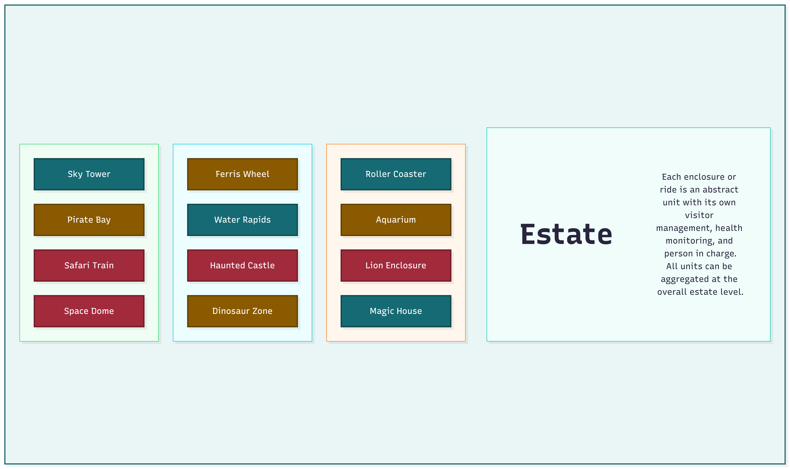
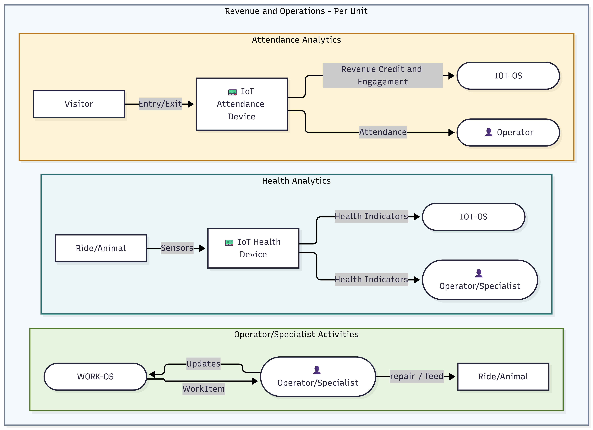
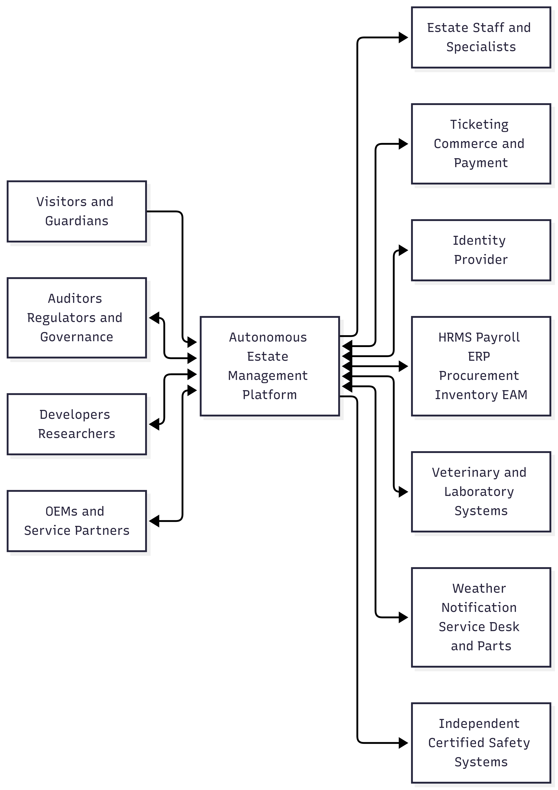
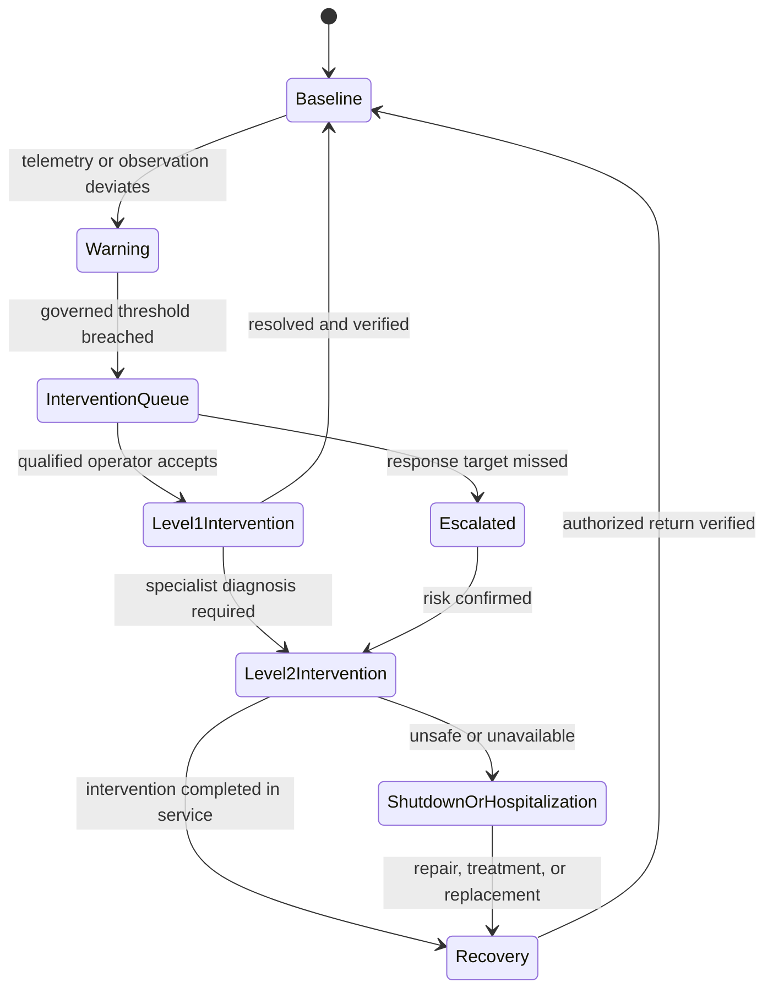

# The Architectural Kata by O'Reilly, September 2026

## Team members

- Sangam Rajpara
- Sarfraz Shaikh
- Jitendra Kasliwal
- Tushar Bane
- Bharat Madhe

## Document Structure

- [Requirements](./requirements/requirements-index.md)
- [Specifications](./specifications/system-specification.md)
- [Architecture](./architecture/architecture-overview.md)

## Table of Contents

- [Introduction](#introduction)
    - [Welcome](#welcome)
    - [Business Case](#business-case)
    - [Background](#background)
    - [Market Opportunity](#market-opportunity)
    - [Objective](#objective)
    - [Key Goals](#key-goals)
    - [Stakeholders](#stakeholders)
- [Tenancy Model](#tenancy-model)
- [Solution Architecture](#solution-architecture)
    - [Estate as Operational Units](#estate-as-operational-units)
    - [Operational Unit Evidence Flow](#operational-unit-evidence-flow)
    - [Core AI Capabilities](#core-ai-capabilities)
    - [Actors and Access Model](#actors-and-access-model)
    - [Integration Model](#integration-model)
- [Unit Identity](#unit-identity)
    - [Unit Operating Model](#unit-operating-model)
    - [Unit Revenue Credit Economics](#unit-revenue-credit-economics)
    - [Unit Maintenance Model](#unit-maintenance-model)
    - [Plan and Re-plan Service](#plan-and-re-plan-service)
    - [AI and Decision Intelligence Governance](#ai-and-decision-intelligence-governance)
    - [Quality and Safety Guardrails](#quality-and-safety-guardrails)
- [Future Goals: Autonomous Actuation Layer](#future-goals---autonomous-actuation-layer)
    - [Robot Trust and Fleet Security](#robot-trust-and-fleet-security)
    - [IoT and Physical Security](#iot-and-physical-security)
    - [What Stays Human-only](#what-stays-human-only)
    - [Commercialization](#commercialization)
    - [Identity, Access, Secrets, and Supply Chain](#identity-access-secrets-and-supply-chain)
    - [Compliance](#compliance)
    - [Capacity and Scale](#capacity-and-scale)

# Introduction

## Welcome

We are PuneArch, a group who believes good architecture starts with understanding the people and responsibilities a system serves, not just the technology behind it.
This submission is our answer to a real operating problem: an estate balancing a historic amusement park with an exotic animal collection, growing visitor demand, and unreliable connectivity. We designed the Autonomous Estate Management Platform to meet that problem directly — resilient at the edge, evidence-based in its recommendations, and clear about where AI assists and where humans decide.
As architects, we see AI's potential to transform how estates like this operate — but only when it's designed, secured, and governed responsibly. That belief shaped every decision in this solution.

## Business Case

## Background

The estate combines more than 40 historic rides with 55 enclosures supporting over 200 animals. It currently receives approximately 5,000 visitors per day and aims to support at least 15,000 within three years of pilot or go-live. That growth will increase pressure on admissions, queue management, animal care, staffing, inspections, maintenance, and financial oversight.

Patchy Wi-Fi and disconnected processes make a timely operating picture difficult to maintain across the large site. Welfare observations, asset status, workforce coverage, visitor presence, work, revenue, and cost sit across different processes and systems. The estate needs a common evidence model that works locally during cloud disruption, links activity to each ride or enclosure, and preserves the authority of qualified people and existing enterprise systems.

## Market Opportunity

The immediate opportunity is to improve the reference estate while creating a configurable platform for zoo, ride, and mixed operators. These organizations share physical assets, public access, specialist workforces, safety or welfare obligations, seasonal demand, intermittent connectivity, and fragmented enterprise data.

The Autonomous Estate Management Platform provides a subscription foundation for edge evidence, offline work, workforce coordination, maintenance insight, visitor flow, unit economics, and governed AI. Zoo, Rides, and Combined editions use entitlements and policy rather than code forks and support shared, dedicated, or self-hosted deployment. Optional AI capability packs and governed ecosystem access create additional commercial paths.

Developer APIs for gaming platforms and governed scientific data research create further monetization opportunities and increase visitor engagement.

Unit Economics differentiates the platform by connecting each ride and enclosure to validated visitor-minutes, utilization, downtime, maintenance cost, and attributable revenue. This supports transparent investment reviews with finance-governed allocation and reconciliation.

Governed AI adds route planning, weather-aware promotion, predictive maintenance insight, and approved content assistance without replacing accountable human decisions.

## Objective

The objective is to establish a resilient estate-management platform that improves welfare and operational visibility, supports visitor growth, coordinates qualified work during cloud disruption, and produces auditable unit-level evidence without transferring consequential authority to AI.

Success means using Unit Economics to expose each unit's contribution and governed AI to improve decision speed and consistency while preserving human authority.

## Key Goals

- **Improve welfare visibility:** Cover at least 200 animals across 55 enclosures while preserving keeper and veterinarian authority.
- **Scale visitor operations:** Support at least 15,000 visitors per day within three years, with aggregated queue and privacy-preserving presence evidence.
- **Maintain continuity:** Keep approved critical workflows operating through 72 continuous hours of cloud isolation.
- **Coordinate qualified work:** Enforce qualification, rest, staffing, and availability constraints with explainable re-planning.
- **Create one configurable product:** Serve multiple estate types and deployment profiles without code forks.
- **Expose Unit Economics:** Connect visitor-minutes, utilization, revenue, operating cost, maintenance cost, and CAPEX to the immutable Operational Unit ID with governed reconciliation.
- **Apply AI responsibly:** Deliver evidence-backed route, promotion, maintenance, and content recommendations while requiring authorized human approval for every consequential action.

## Stakeholders

### Internal Stakeholders

- **Estate leadership and product ownership:** Set investment priorities, targets, commercial policy, and phase decisions.
- **Animal-care, veterinary, and maintenance teams:** Act on evidence while retaining clinical, welfare, safety, and return-to-service authority.
- **Operations and workforce planning:** Manage qualified coverage, procedures, handovers, substitution, and escalation.
- **Finance and administration:** Govern authoritative records, cost allocation, reconciliation, qualifications, and purchasing.
- **Technology and governance teams:** Operate integrations, resilience, security, privacy, AI assurance, and evidence controls.

### External Stakeholders

- **Visitors and guardians:** Need safe, accessible, privacy-preserving admission, navigation, and engagement.
- **Regulators, inspectors, and auditors:** Require purpose-limited access to trustworthy compliance evidence.
- **Enterprise and service providers:** Retain authority for source records and integrate through versioned, reconciled contracts.
- **Future customer operators and ecosystem partners:** Adopt governed editions, APIs, or deployment profiles without unrestricted data access.

This draft records no approval, implementation evidence, achieved benefit, or regulatory certification.

# Tenancy Model

The tenancy model prepares the platform for expansion across additional estates and locations while enabling it to be offered as an operational service without requiring the platform provider to own the physical estate. Each deployment profile defines how the vendor, operator, and customer divide responsibility for the platform, tenant data, and estate edge.

| Deployment profile | Management plane           | Tenant data plane                                              | Estate edge     |
| ------------------ | -------------------------- | -------------------------------------------------------------- | --------------- |
| Shared SaaS        | Vendor shared              | Logically isolated shared services and tenant-partitioned data | Operator estate |
| Dedicated hosted   | Vendor shared or dedicated | Dedicated subscription/account and data services               | Operator estate |
| Self-hosted        | Vendor or customer managed | Customer private cloud under the same product contract         | Customer estate |

Zoo, Rides, and Combined editions are entitlements and policy bundles, not forks. Shared, dedicated, and self-hosted profiles use the same domain contracts, policy schema, audit model, upgrade path, and conformance suite. Tenant identity is carried through API, event, storage, cache, log, metric, secret, backup, fleet, and support-session boundaries; cross-tenant access is a release-blocking failure.

Related proposed ADR: [ADR-005: Portable Multi-Tenant Deployment](./architecture/adr/ADR-005-portable-multi-tenant-deployment.md).

# Solution Architecture

| Principle                                                  | Decision                                                                                                                                                   | Rationale                                                                                                           | Related proposed ADR |
| ---------------------------------------------------------- | ---------------------------------------------------------------------------------------------------------------------------------------------------------- | ------------------------------------------------------------------------------------------------------------------- | -------------------- |
| Radio-first edge collection                                | Private LoRaWAN with two shared receiver hubs and overlapping coverage for Product 1; a third diverse route or hub is required before autonomous actuation | Patchy Wi-Fi across a large site; low-cost coverage without accepting a single point of operational visibility loss | [ADR-001](./architecture/adr/ADR-001-radio-first-edge-connectivity.md) |
| Visitor presence                                           | RFID or approved counters collect minimum necessary pseudonymous entry, occupancy, exit, and duration evidence for each unit at the edge                   | Measures visitor-minutes without creating unnecessary identity trails                                               | [ADR-008](./architecture/adr/ADR-008-privacy-minimized-visitor-presence.md) |
| Visitor queue visibility                                   | Current queue estimates are derived from entry, occupancy, exit, and capacity evidence and published only as aggregated status                             | Helps visitors choose shorter queues while preserving individual movement privacy                                   | [ADR-008](./architecture/adr/ADR-008-privacy-minimized-visitor-presence.md) |
| Unit identity                                              | Every ride and enclosure has one immutable Operational Unit ID retained across device replacement, refurbishment, and renaming                             | Joins operational, workforce, maintenance, capital, visitor, and financial evidence to the correct physical unit    | [ADR-007](./architecture/adr/ADR-007-operational-unit-identity.md) |
| Unit cost profile                                          | Effective-dated Operations Cost, Maintenance Cost, and CAPEX allocations are maintained for every unit                                                     | Produces a complete attributable-cost view per enclosure or ride                                                    | [ADR-011](./architecture/adr/ADR-011-unit-credit-economics.md) |
| Visitor-minute credit allocation                           | Each validated visitor-minute earns the unit its effective Unit Credit weight, $X$                                                                         | Creates a consistent, auditable measure of engagement and attributable revenue                                      | [ADR-011](./architecture/adr/ADR-011-unit-credit-economics.md) |
| Unit economics reporting                                   | Credits are valued or allocated under governed finance rules and compared with attributable operating, maintenance, and capital cost                       | Supports investment, sustainment, refurbishment, and closure review with operational context                        | [ADR-011](./architecture/adr/ADR-011-unit-credit-economics.md) |
| Minimal data, human-controlled AI                          | Data minimization; AI produces findings or recommendations; policy and human approval govern consequential action                                          | Keeps safety, welfare, finance, and public communication accountable                                                | [ADR-004](./architecture/adr/ADR-004-human-controlled-ai.md) |
| Critical local, routine batch                              | Critical processing and approved alerts run at the edge; routine telemetry is promoted and synchronized hourly where practical and within four hours       | Real time is funded only for critical events and admission decisions                                                | [ADR-002](./architecture/adr/ADR-002-edge-critical-processing.md) |
| Serverless cloud, modular monolith                         | Serverless services with a modular-monolith product boundary and explicit domain modules                                                                   | Minimizes idle cost and operational overhead while preserving a defined decomposition path                          | [ADR-003](./architecture/adr/ADR-003-serverless-modular-monolith.md) |
| Composable products, tenant isolation, portable deployment | Editions and tenancy are entitlement and policy, not code forks                                                                                            | One codebase serves Zoo, Rides, and Combined editions across shared, dedicated, and self-hosted topologies          | [ADR-005](./architecture/adr/ADR-005-portable-multi-tenant-deployment.md) |
| Local medallion data plane                                 | Bronze, Silver, and Gold data is promoted at the edge according to retention and quality policy                                                            | Cloud transfer carries validated, purposeful data while local evidence survives WAN loss                            | [ADR-009](./architecture/adr/ADR-009-local-medallion-data-plane.md) |
| Governed edge vision                                       | Counting and species recognition by default; biometric capabilities disabled and separately gated                                                          | Privacy-safe default posture                                                                                        | [ADR-008](./architecture/adr/ADR-008-privacy-minimized-visitor-presence.md) |
| Digital ecosystem                                          | Governed developer, game, research, OEM, and regulator access                                                                                              | Raw operational data does not leave the tenant boundary without explicit purpose and policy                         | [ADR-013](./architecture/adr/ADR-013-contextual-access-and-pam.md) |
| Fleet and delegated operations                             | Remote lifecycle management with scoped delegated support for devices, robots, and drones                                                                  | Supports multi-estate operation and third-party maintenance without standing privileged access                      | [ADR-014](./architecture/adr/ADR-014-signed-supply-chain-and-device-lifecycle.md) |
| COTS enterprise authority                                  | Ticketing, HRMS, payroll, ERP, procurement, inventory, and EAM remain authoritative for their records                                                      | The platform integrates and reconciles rather than replacing commodity systems of record                            | [ADR-006](./architecture/adr/ADR-006-cots-authority-and-reconciliation.md) |
| Local workforce coordination                               | Shift, task, procedure, and presence evidence work without WAN connectivity                                                                                | Field operations continue through a 72-hour cloud isolation window                                                  | [ADR-010](./architecture/adr/ADR-010-local-workforce-coordination.md) |
| Animal/population identity                                 | Animal and population identity is independent of enclosure and monitoring devices                                                                          | Welfare history survives movement, device replacement, and group change                                             | [ADR-015](./architecture/adr/ADR-015-independent-animal-population-identity.md) |

## Estate as Operational Units

[Mermaid source backup](./diagrams/README.md#estate-as-operational-units)

## Operational Unit Evidence Flow

[Mermaid source backup](./diagrams/README.md#operational-unit-evidence-flow)

## Core AI capabilities

AI is a core capability layer of the solution architecture, serving both customer-facing experiences and estate operations. AI detects patterns, explains relevant context, and recommends next-best actions; deterministic policy, authorized human review, and independent safety controls govern consequential outcomes.

Related proposed ADR: [ADR-004: Keep People in Control of AI Decisions](./architecture/adr/ADR-004-human-controlled-ai.md).

| Capability                                   | Solution role                                                                                                                                      | Governance boundary                                                                                                                                                                                                                                                                                                                                                                                                           |
| -------------------------------------------- | -------------------------------------------------------------------------------------------------------------------------------------------------- | ----------------------------------------------------------------------------------------------------------------------------------------------------------------------------------------------------------------------------------------------------------------------------------------------------------------------------------------------------------------------------------------------------------------------------- |
| Route and queue assistant                    | Suggests an itinerary at entry using opening status, queue estimate, accessibility needs, group preferences, weather, and available time           | Suggestions remain optional, explain material constraints, avoid unsafe or inaccessible routes, and use personal preferences only with consent; every ride and enclosure remains visible as included or skipped, every skipped item shows the reason, and visitors can add any skipped available item to recalculate the itinerary unless a deterministic closure, safety, capacity, or entitlement rule makes it unavailable |
| Zoo social-media strategist                  | Proposes campaign themes, schedules, channel variants, and approved content for events such as births, conservation milestones, or new experiences | Keeper, welfare, safeguarding, and marketing approval is required before publication; sensitive events are excluded by policy                                                                                                                                                                                                                                                                                                 |
| Weather-aware experience promotion           | Combines weather forecasts with approved historical patterns to recommend suitable indoor, outdoor, ride, or animal-viewing experiences            | Presents likely conditions rather than promising animal behavior; deterministic closure, welfare, and safety rules always take precedence                                                                                                                                                                                                                                                                                     |
| Predictive maintenance and lifecycle insight | Prioritizes possible ride/enclosure maintenance, hardware failure risk, device battery replacement, and software/firmware update planning          | AI recommends investigation or timing only; qualified staff approve diagnosis, work, update rollout, shutdown, and return to service                                                                                                                                                                                                                                                                                          |
| Affinity-content assistant                   | Drafts personalized but policy-constrained animal updates, Virtual Pet activities, adoption messages, and Grow Together milestones                 | Uses only approved public facts and consented profile data; human review applies to welfare-sensitive, child-facing, and public content                                                                                                                                                                                                                                                                                       |

The evaluation harness and AI-as-judge controls in section 7.5 apply to every AI capability. Commercial pressure cannot lower safety, welfare, privacy, factuality, or human-approval thresholds, and recommendations must remain available through deterministic or staff-operated fallback paths when AI is disabled.

## Actors and Access Model

Actors are either personas, representing people or accountable organizations, or domain subjects, representing animals and populations that never authenticate or hold permissions.

Related proposed ADRs: [ADR-013: Contextual Access and Privileged Elevation](./architecture/adr/ADR-013-contextual-access-and-pam.md) and [ADR-015: Independent Animal and Population Identity](./architecture/adr/ADR-015-independent-animal-population-identity.md).

[Mermaid source backup](./diagrams/README.md#actors-and-access-model)

| Group | Theme                                 | Representative personas                                                                                                                                                                                                 |
| ----- | ------------------------------------- | ----------------------------------------------------------------------------------------------------------------------------------------------------------------------------------------------------------------------- |
| A     | Visitors and visitor support          | Visitor, parent or guardian, child, visitor-services colleague                                                                                                                                                          |
| B     | Animal care and veterinary operations | Animal keeper, veterinarian, animal-care supervisor                                                                                                                                                                     |
| C     | Management and administration         | Workforce planner, HR administrator, payroll administrator, procurement officer, finance controller, estate executive, product owner, marketing/engagement manager, stores coordinator                                  |
| D     | Estate operations and field execution | Full-time, contract, or on-demand ride operator, enclosure lead, admissions colleague, operations supervisor, security/first responder, field employee, contractor, on-demand doctor/specialist, maintenance technician |
| E     | Governance and oversight              | Safety and compliance lead, privacy and safeguarding lead, inspector, auditor, regulator                                                                                                                                |
| F     | Technology and insight                | Estate IT administrator, data and insight analyst                                                                                                                                                                       |
| G     | External ecosystem                    | Developer/game studio, researcher, external workforce provider, governance partner, service partner, Original Equipment Manufacturer (OEM)                                                                              |
| H     | Animal and population domain subjects | Individual animal, managed population, mixed-species display; records only, never personas                                                                                                                              |

Access combines a baseline permission tier with estate, unit, domain, shift, purpose, data-class, and time attributes. A tier is not a blanket grant: for example, a payroll administrator cannot read welfare records, a veterinarian cannot approve financial settlement, and a platform administrator has no standing access to either.

| Tier                                               | Personas                                                                                                                           | Default access                                                                                                                               |
| -------------------------------------------------- | ---------------------------------------------------------------------------------------------------------------------------------- | -------------------------------------------------------------------------------------------------------------------------------------------- |
| 0 — Self-service and aggregated visibility         | Visitor, parent/guardian, estate executive, data/insight analyst, marketing/engagement manager                                     | Own transactions, entitlements, consent, and requests; or aggregated, de-identified estate insight according to persona                      |
| 1 — Field execution                                | Ride operator, admissions colleague, keeper, maintenance technician, field employee                                                | Assigned unit, task, and shift only; procedure execution and evidence capture; no cross-estate reach                                         |
| 2 — Supervisory approval                           | Operations supervisor, animal-care supervisor, workforce planner, stores coordinator                                               | Unit-group planning, re-planning, escalation, and approval within an active responsibility window                                            |
| 3 — Specialist, governance, and business authority | Veterinarian, safety/compliance lead, privacy/safeguarding lead, HR/payroll administrator, procurement officer, finance controller | Sensitive records and consequential approvals only within the named professional domain; no override of independent certified safety systems |
| 4 — Platform administration                        | Estate IT administrator, delegated operations administrator                                                                        | Tenant, integration, device, and configuration scope; sensitive data requires logged, approved, time-boxed elevation                         |
| 5 — External/ecosystem                             | Developer/game studio, researcher, inspector/auditor/regulator, OEM, supplier, field-service provider                              | Purpose-limited API, governed export, or time-bound delegated workflow; never unrestricted raw operational data                              |
| Domain subjects                                    | Individual animal, managed population, mixed-species display                                                                       | No credentials or permissions; represented through immutable domain records linked to an operational unit                                    |

Every persona-to-data-class and persona-to-action mapping, including welfare, child/guardian, payroll, financial, safety-adjacent, robot, and drone actions, is held in a machine-readable, versioned policy table. The Safety and Compliance lead coordinates quarterly access review with each accountable domain owner; emergency elevation is time-boxed, reason-coded, and audited.

## Integration Model

Related proposed ADR: [ADR-006: COTS Authority and Reconciliation](./architecture/adr/ADR-006-cots-authority-and-reconciliation.md).

| External system | Style | Cadence | Authority |
|---|---|---|---|
| Ticketing and commerce provider | Versioned API, signed webhook, entitlement feed | Synchronous plus reconciliation batch | Provider owns product sale, order, refund, and issued entitlement; platform owns local admission evidence |
| Payment provider | Hosted checkout, token, signed webhook | Synchronous | Provider owns card data and payment authorization |
| Identity provider | OIDC/OAuth 2.0 federation | Synchronous | Provider owns workforce identity and authentication |
| Notification provider | HTTPS API | Near real time | Provider owns delivery; platform owns notification intent and status |
| Veterinary and laboratory systems | Versioned API or governed file exchange | Event/batch | External clinical system owns imported diagnosis and laboratory result; platform owns local welfare observations |
| Weather and event data | HTTPS API or governed file exchange | Batch; feeds forecasting and re-planning | External system |
| Independent safety systems | Isolated read-only interface | Near real time where certified and available | Independent safety system; never controlled by the platform |
| Service desk and parts providers | Versioned HTTPS API/events | Event/batch | Contracted system according to work or parts record |
| HRMS and payroll (COTS) | Versioned API/events/files | Event/batch, reconciled | HRMS/payroll owns person, employment, qualification, and payroll records |
| ERP, procurement, inventory, and EAM (COTS) | Versioned API/events/files | Event/batch, reconciled | ERP/EAM owns approved purchasing, inventory, asset, work, cost, and accounting records |

Adapters use versioned contracts, least-privilege service identities, idempotent delivery, durable outbox/inbox queues, dead-letter handling, and scheduled reconciliation. Each field has one declared authority; conflicts enter an owned resolution queue instead of silently overwriting confirmed state. The platform never becomes the system of record for payroll, tax, card data, or the general ledger.

# Unit Identity

### Unit Operating Model

Each ride and each enclosure, together with its linked animal or population subjects, is represented as a telemetry-backed Operational Unit. It has an immutable Unit ID and acts as a small management-accounting entity with its own operating responsibility, commercial profile, telemetry, utilization, health, revenue credits, and attributable costs. The Unit ID survives device replacement, refurbishment, renaming, operator change, animal movement, and temporary shutdown.

Related proposed ADRs: [ADR-007: Immutable Operational Unit Identity](./architecture/adr/ADR-007-operational-unit-identity.md) and [ADR-015: Independent Animal and Population Identity](./architecture/adr/ADR-015-independent-animal-population-identity.md).

| Dimension | Unit model |
|---|---|
| Identity and classification | Immutable Unit ID; unit type; location; lifecycle state; linked devices, assets, animals, populations, and authoritative enterprise records |
| Accountable operation | A qualified ride operator, keeper, or unit lead is assigned through the plan, schedule, and shift systems; certification, staffing ratio, check-in, handover, and substitution rules are enforced |
| Marketing and sales profile | Governed public name, description, availability, capacity, audience, campaign/package eligibility, and sales attribution profile |
| Operating evidence | Telemetry, inspections, care observations, visitor presence, queue estimate, task completion, incidents, data freshness, and confidence are time-linked to the Unit ID |
| Cost structure | Effective-dated Operations Cost, Maintenance Cost, and CAPEX allocation are attributed from authoritative ERP, EAM, procurement, and workforce systems |
| Earning model | Visitor-minutes earn Unit Credits; governed pricing or package-allocation rules convert those credits into attributable revenue |
| Utilization and health | Capacity utilization, availability, downtime, welfare or asset-health state, maintenance backlog, demand, and data quality are reported together |
| Decision support | Authorized owners compare contribution, strategic value, welfare, heritage, safety, and demand before investing, re-planning, pausing, refurbishing, or retiring a unit |

The Operational Unit is not a legal entity, payroll ledger, or general-ledger substitute. Animal and managed-population identities retain separate, immutable welfare histories and link to the current enclosure Unit ID. Low profitability may trigger review, but never automatic shutdown: animal welfare, ride safety, heritage obligations, contractual commitments, and strategic value remain human-governed constraints.

### Unit Revenue Credit Economics

Related proposed ADR: [ADR-011: Unit Credit Economics](./architecture/adr/ADR-011-unit-credit-economics.md).

| Layer | Owns | Changes how often |
|---|---|---|
| Unit Credit weight, $X$ | Product and commercial governance | Rarely; effective-dated |
| Price per credit, $P$ | Finance and commercial governance | Seasonally or by approved campaign |
| Package or entitlement (basic/moderate/premium/group) | Marketing and product | Frequently, within approved policy |
| Cost allocation policy | Finance, ERP, and EAM owners | By accounting period or approved investment case |

For unit $u$ in period $t$, Unit Credits are calculated as $C_{u,t} = M_{u,t} \times X_{u,t}$, where $M$ is validated visitor-minutes and $X$ is the effective-dated Unit Credit weight. Standalone attributable revenue is $R_{u,t} = C_{u,t} \times P_t$, where $P$ is the governed price per credit. Package revenue is allocated once, in proportion to eligible Unit Credits earned during the allocation window, so the same visitor-minute is not counted as both standalone and package revenue.

Unit contribution is attributed revenue less Operations Cost, Maintenance Cost, and the governed CAPEX allocation. Reports show utilization, downtime, data completeness, credit-weight version, price version, package rule, cost-allocation rule, and reconciliation status, so profitability is never presented without operating context.

Unit Credit weight $X$ applies only to a Unit ID; Cost Pools do not earn credits. AI may recommend a weight or price adjustment from demand, utilization signals, Day of Week, Holidays or Season. 

### Unit Maintenance Model

Ride and enclosure units follow one governed signal-to-intervention path. Telemetry and human observations establish a baseline, expose deviation, and create an intervention with a named owner and response target. AI may prioritize or explain evidence, but it does not diagnose a mechanical failure, authorize treatment, declare a ride safe, or make a welfare judgment.

| Level | Ride unit | Enclosure, animal, or population context | Authority and outcome |
|---|---|---|---|
| Level 1 - on-unit intervention | Inspection, cleaning, reset, adjustment, or minor maintenance from an approved procedure | Routine husbandry check, feeding verification, environmental correction, observation, or approved non-clinical care task | Qualified assigned operator or keeper; resolve and verify, or escalate |
| Level 2 - specialist/external intervention | Specialist diagnosis, OEM service, part replacement, major repair, certification, or controlled shutdown | Veterinary assessment, specialist treatment, transfer, isolation, hospitalization, or enclosure shutdown | Authorized technician, veterinarian, OEM, or external specialist; independent return-to-service or welfare approval required |

Missing certification, unresolved critical evidence, or stale safety/welfare data defaults the workflow to the safer state. 

### Plan and re-plan service

The operational plan, covering shifts, tasks, care activities, inspections, and maintenance windows, is a first-class coordination object. Its constraint model includes role qualification, certification, working-time and rest rules, safety staffing ratios, task duration, unit availability, and equipment/robot availability. HRMS remains authoritative for people and qualifications; EAM remains authoritative for approved asset work; the platform owns the current operational plan and its execution evidence.

Related proposed ADR: [ADR-010: Local Workforce Coordination](./architecture/adr/ADR-010-local-workforce-coordination.md).

Re-planning triggers include staff absence, missing mandatory coverage, asset failure, welfare alert, weather change, demand change, robot/drone unavailability, and task overrun. Each trigger maps to a versioned rule such as substitution priority or escalation when no qualified replacement exists within the response window. Every re-plan produces a new plan version and an explained diff, not a silent mutation. The local coordinator supports assigned shifts, procedures, evidence, check-in, handover, and conflict capture through 72 hours of WAN loss, then synchronizes idempotently.

### AI and decision intelligence governance

Related proposed ADR: [ADR-004: Keep People in Control of AI Decisions](./architecture/adr/ADR-004-human-controlled-ai.md).

| Control | Design |
|---|---|
| Capability ownership | Every AI capability has a named owner, purpose, risk class, approved data, evaluation set, quality threshold, cost/latency budget, fallback, and rollback |
| Model versioning | Every finding or recommendation is tagged with model, provider, prompt, and policy versions; rollout progresses through shadow, canary, estate subset, and full release |
| Drift monitoring | Recommendation-versus-outcome and data-distribution checks run on a governed schedule; threshold breach alerts the AI governance owner and can disable the capability |
| Adversarial/prompt-injection defense | Natural-language interfaces use input isolation, sanitization, intent classification, grounded retrieval, and output policy; this layer cannot trigger consequential action |
| Explainability | Every recommendation carries a human-readable evidence package: source signals and freshness, applicable rule, model/prompt version, confidence and uncertainty, material factors, alternatives considered, and the reason for the proposed action. Explanations expose decision evidence without requiring or storing hidden model reasoning |
| Evaluation harness | A versioned harness runs representative, edge, adversarial, safety, privacy, fairness, latency, and cost scenarios against fixed datasets and expected outcomes. It combines deterministic assertions, domain metrics, human-reviewed golden cases, and regression comparison; the same harness gates promotion and supports scheduled production sampling |
| AI as judge | A separately versioned evaluator model may score groundedness, relevance, policy adherence, and explanation quality where deterministic metrics are insufficient. Its rubric, evidence, model version, score, and disagreement are retained; it is calibrated against qualified human reviewers and cannot be the sole release gate or approve safety, welfare, financial, legal, or public actions |
| Data poisoning defense | Training and reference-data provenance is tracked; edge-sourced retraining evidence passes quality, anomaly, consent, and approval gates |
| Autonomous action governance | Automation is limited to a pre-declared, low-risk, reversible action catalog; anything outside the catalog defaults to human review |
| Audit trail | An immutable trail links observation, model output, policy decision, approval or rejection, execution, correction, and measured outcome per unit and persona |

Harness results are reproducible by capability, dataset, configuration, and version. Release requires all deterministic safety assertions to pass, task-specific thresholds to be met, and judge-versus-human agreement to remain within an approved tolerance. Judge failure, disagreement, suspected shared-model bias, or unavailable evidence routes the case to qualified human review and never defaults to approval.

Models never suppress a deterministic critical alert or become authoritative for tickets, safety status, animal treatment, population correction, financial settlement, or public communication. Staff can correct AI output with a reason; approved corrections feed evaluation and improvement rather than silently changing historical evidence.

### Quality and safety guardrails

| Attribute | Target |
|---|---|
| Tenant isolation | Zero unauthorized cross-tenant reads, writes, events, logs, cache hits, metrics, secrets, backups, fleet commands, or support sessions |
| Local operation | Approved critical alerting, animal care, admission, device, workforce, and dashboard functions operate through tested 72-hour cloud isolation and replay |
| Alert timeliness | A valid critical local observation raises an edge alert within 10 seconds; responsible central staff see it within 60 seconds when cloud connectivity is available |
| Safer state | Missing or expired inspection, certification, or critical evidence cannot present a ride as available; late or duplicate telemetry cannot overwrite newer confirmed state |
| Biometric privacy | Facial recognition is off by default and requires lawful basis, necessity, proportionality, consent where applicable, residency, retention, and stakeholder approval |
| Deployment portability | Shared, dedicated, and self-hosted topologies pass the same functional, security, backup/restore, offline, and AI conformance suites |
| Financial integrity | Idempotent attribution and reconciliation prevent duplicate revenue; journal batches balance to zero before authoritative posting |

# Future Goals - Autonomous Actuation Layer

Product 1 with certified ground-robot and drone classes that execute pre-approved physical actions inside mission-specific safety envelopes. It activates only after Product 1 reaches operational maturity, evidence and approval workflows are proven, and each hardware, payload, route, unit type, and action class passes applicable safety and regulatory certification.

| Asset class | Approved task examples | Preconditions and exclusions |
|---|---|---|
| Ground patrol robot | Scheduled perimeter or closed-zone patrol; capture thermal, visual, or acoustic evidence; report an anomaly | Observe and report only; no confrontation, facial recognition, safety declaration, or animal-welfare judgment |
| Ground cleaning robot | Sweep, wash, collect waste, or disinfect an approved unoccupied route | Approved material and route; visitor/animal exclusion zone; stop on spill, obstruction, proximity, or containment alert |
| Ground inspection and minor-maintenance robot | Read gauges, image equipment, collect vibration/thermal evidence, lubricate or replace a declared non-safety consumable | No diagnosis or certified safety work; human accepts evidence and any return-to-service decision |
| Ground transport robot | Move sealed food, parts, tools, samples, or supplies between controlled handoff points | Payload, temperature, contamination, custody, weight, and destination checks; no uncontrolled animal or visitor contact |
| Aerial patrol and inspection drone | Inspect roofs, fencing, waterways, remote enclosures, vegetation, or inaccessible equipment | Geofenced route, weather and airspace clearance, privacy mask, safe landing plan; no crowd overflight unless separately certified |
| IoT service drone | Detach and replace an approved battery-powered sensor or radio node | Non-safety IoT only; verify Unit ID and Device ID before detachment, retain old/new evidence, test signal, and roll back or escalate on mismatch |
| Delivery drone | Deliver sealed operator supplies or a pre-measured animal-food payload to an approved drop zone or feeder | Keeper-approved plan, species/payload/route match, chain of custody, positive release confirmation; no medicine, live prey, or ad hoc feeding decision |

Ground and aerial assets may hand off a payload or inspection task only through a declared workflow with compatible hardware, a controlled transfer zone, and one mission owner. A robot or drone never improvises a new task from natural language; it executes a signed mission compiled from the approved action catalog and returns telemetry, evidence, exceptions, and completion status to Product 1.

### Robot trust and fleet security

| Control | Design |
|---|---|
| Robot identity | Every ground robot and drone has hardware-rooted identity and attested provisioning; an untrusted asset cannot join the fleet |
| Fleet control plane | Extends device fleet management with robot/drone commissioning, certification state, maintenance, battery, payload, route entitlement, staged update, decommissioning, and quarantine |
| Mission authorization | A signed mission binds tenant, estate, asset, Unit ID, action class, route/geofence, payload, approver/policy, start window, expiry, and abort behavior |
| Safety interlocks | Ground assets use independent proximity and emergency-stop controls; drones use certified geofence, altitude, collision, lost-link, safe-return/landing, and flight-termination controls appropriate to the mission |
| Anti-hijacking | Command and telemetry channels are mutually authenticated, encrypted, replay-protected, and rate-limited; anomalous commands or navigation data trigger safe stop/return and quarantine |
| Action catalog | Assets execute only certified, pre-declared, low-risk actions for their class; open-ended task assignment and model-generated control code are prohibited |
| Payload and device custody | Seals, weight, temperature where needed, source/destination identity, handoff confirmation, replaced-device identity, and mission evidence are auditable |
| Human control | Authorized staff can pause, abort, or quarantine a mission; emergency-stop and flight-safety controls do not depend on cloud or AI availability |

### IoT and physical security

Before Product 2 activation, radio resilience uses a minimum of three geographically diverse receiver hubs or an equivalently independent communication route with overlapping coverage. Loss of one hub degrades capacity rather than eliminating command, alert, or visibility coverage. Field devices buffer critical welfare and safety evidence for prioritized replay; robots and drones follow certified lost-link behavior and do not depend on store-and-forward as permission to continue an unsafe mission.

| Threat | Control |
|---|---|
| Sensor tampering or spoofing | Signed telemetry from provisioned devices only; anomalous signal patterns are quarantined or flagged, never silently trusted |
| Physical intrusion at hubs/gateways | Tamper-evident enclosures; intrusion is a monitored event; compromised segments are isolated |
| Rogue robotics | Hardware identity, signed missions, class/route entitlement, independent interlocks, anomaly quarantine, and human emergency stop |
| Drone navigation spoofing or lost link | Multi-signal plausibility checks, geofence, inertial fallback, route limits, safe hover/return/landing policy, and immediate operator alert |
| Network segmentation | OT sensors, hubs, robots, and drones are segmented from workforce apps and cloud IT; cross-segment traffic uses allow-listed protocols through a defined gateway |
| Edge gateway compromise | Gateways run minimal attested firmware; compromise isolates only that gateway segment and revokes its command authority |
| Unsafe software update | Signed artifact, SBOM and compatibility check, staged rollout, health stop condition, rollback, and no update during an active mission |
| Air-gapped fallback | Critical alerting, admission, animal-care, and workforce evidence continue locally for 72 hours; non-critical analytics queue; physical missions fail to their certified safe state on lost authority |

### What stays human-only

Major mechanical-failure diagnosis and repair authorization; emergency medical response; safety-incident command; legal and regulatory decisions; animal-welfare judgment requiring clinical or ethical assessment; prescription, treatment, hospitalization, transfer, or euthanasia decisions; certified ride, containment, fire, or life-support work; approval of a new robot/drone action class, route, payload, or safety envelope; and approval of any action outside the pre-declared low-risk catalog.

## Commercialization

### Market and product strategy

Go-to-market focuses first on zoo and ride operators. The Operations Intelligence Platform sells on unit economics, privacy-preserving visitor presence and queue visibility, MQTT-based welfare monitoring, workforce re-planning, asset health, offline resilience, and a SOC 2-track security posture.

| Offer | Commercial model | Buyer value |
|---|---|---|
| Operations Intelligence Platform | Subscription by estate, edition, Operational Unit band, and support tier | One governed view of unit contribution, welfare, workforce, maintenance, visitor flow, and operational risk |
| AI capability packs | Optional governed capabilities by use case, usage band, and assurance tier | Forecasting, recommendations, content assistance, and anomaly prioritization with evaluation, explainability, and human review |
| Autonomous Actuation Layer | Certified ground-robot or drone class, fleet capacity, approved mission type, and support tier | Lower cost and safer execution of repetitive patrol, cleaning, inspection, transport, IoT-service, and delivery tasks |
| Ecosystem access | Governed API, research export, developer sandbox, or partner integration tier | Purpose-limited innovation without exposing unrestricted operational or personal data |

Product 2 enters the market only after Product 1 is proven at reference estates and each ground-robot or drone class passes applicable safety, aviation, welfare, and operating certification. It is sold by certified action, route, payload, and support class rather than as unrestricted autonomy.

The Unit Credit model can extend to resorts with activity zones, arcade areas, museums, heritage venues, and other operators that need to compare engagement, attributable revenue, operating cost, maintenance cost, and capital allocation at a stable unit boundary. The combined unit-economics, welfare, workforce, asset, visitor, fleet, and AI evidence pipeline differentiates the platform from point solutions such as pure EAM, ticketing, HRMS, telemetry, or robotics products.

### Visitor engagement and revenue offers

| Offer | Visitor experience | Commercial and governance model |
|---|---|---|
| Animal affinity subscription | Consent-based updates for visitors who choose to follow an animal or managed population | Uses keeper-approved public updates and suitable welfare evidence; subscriptions can support free and premium tiers |
| Virtual Pets, symbolic Adoption, and Grow Together | A digital relationship that follows approved milestones, educational content, conservation stories, and age-appropriate activities over time | Adoption is sponsorship, not ownership; content never exposes sensitive welfare records or guarantees animal access, health, or behavior |
| Visitor Coins | Coins may be awarded with a day/family pass or approved campaign and redeemed for Virtual Reality experiences, selected merchandise, or a future ticket discount | Closed-loop promotional loyalty value with published earning, expiry, refund, fraud, and guardian rules; no cash value or transfer by default |
| Future token-based pass | A visitor buys a governed entitlement balance and spends tokens on eligible ride, enclosure, premium, or virtual experiences; unused balance may remain available for a later visit or the virtual world | Future phase subject to capacity, refund, expiry, tax, stored-value, consumer-protection, accessibility, and reconciliation review; tokens are not cryptocurrency or blockchain assets by default |
| Merchandise | Visitors buy approved estate, ride, enclosure, animal, conservation, and virtual-experience merchandise such as caps and T-shirts | Existing commerce, payment, inventory, and fulfilment providers remain authoritative; Unit ID and campaign codes support attribution |
| Estate promotion | Campaigns advertise the estate, events, packages, new experiences, conservation programs, and seasonal offers through approved external channels | Consent, attribution, brand, welfare, and public-content approval policies apply |
| On-estate digital advertising | Digital screens present estate information, cross-promotions, sponsored content, merchandise, food, events, and under-used units | Operational, accessibility, queue, and emergency content takes priority; advertisements are labeled, brand-safe, frequency-limited, and do not use covert profiling |

Unit Credits, Visitor Coins, and Pass Tokens are separate concepts. **Unit Credits** are internal, non-transferable management-accounting measures earned by an Operational Unit from validated visitor-minutes. **Visitor Coins** are promotional loyalty rewards. **Pass Tokens** are future customer entitlements representing prepaid access. They use separate ledgers, policies, expiry rules, reconciliation, and financial treatment, and one balance is never silently converted into another.

### Commercial guardrails

- Existing ticketing, payment, identity, inventory, ERP, and EAM providers remain authoritative; the platform coordinates entitlements, experience delivery, attribution, and reconciliation.
- Child-facing loyalty, Virtual Pet, adoption, gaming, and personalization features require verified guardian control, age-appropriate design, restricted messaging, moderation, and deletion/withdrawal workflows.
- Animal stories and campaigns require keeper-approved public facts and must not create unsafe feeding, handling, visitation, or welfare incentives.
- Coins, tokens, discounts, advertisements, and recommendations must not disadvantage visitors who use accessibility alternatives, decline tracking, or do not participate in loyalty programs.
- Revenue from passes, tokens, packages, merchandise, advertising, sponsorship, and virtual experiences is reconciled independently before it is attributed to Operational Units through governed Unit Credit rules.

## Identity, Access, Secrets, and Supply Chain

Related proposed ADRs: [ADR-013: Contextual Access and Privileged Elevation](./architecture/adr/ADR-013-contextual-access-and-pam.md) and [ADR-014: Signed Supply Chain and Device Lifecycle](./architecture/adr/ADR-014-signed-supply-chain-and-device-lifecycle.md).

| Area | Design |
|---|---|
| IAM | Permission tiers and contextual policy use OIDC/OAuth 2.0 federation to the operator identity provider; the platform does not become a second workforce identity source |
| PAM | Platform, delegated-operator, OEM, support, and emergency access is time-bound, scoped, approved, and logged; standing access to PII, welfare, payroll, fleet command, or financial data is disallowed |
| Secrets management | A centralized secrets store issues short-lived credentials; no reusable secret is embedded in application, device, robot, or drone firmware/configuration; rotation and revocation are automated |
| Certificate management | Automated issuance, attestation, renewal, rotation, expiry monitoring, and revocation for device, gateway, robot, drone, workload, integration, and mission-signing identities |
| Supply chain | Hardware, firmware, models, libraries, containers, and OEM components are tracked in the SBOM; signed OTA updates are verified before install, staged, monitored, and rolled back on failure |
| Build and release | Provenance, dependency and malware scanning, policy checks, separation of duties, immutable artifacts, and environment promotion apply to cloud, edge, model, robot, and drone releases |

## Compliance

| Framework | Scope | Rationale |
|---|---|---|
| SOC 2 | In scope, first priority | Broad enterprise-buyer signal; drives IAM, change, availability, audit, support, and secrets controls |
| ISO/IEC 27001 | In scope | Reuses the same risk and control catalog as SOC 2 across vendor and customer-hosted deployment |
| GDPR or regional equivalent | In scope | Requires DPIA, lawful-basis, consent, minimization, retention, data-subject rights, processor, residency, and transfer controls |
| PCI DSS | Minimized scope | Hosted checkout and tokenized provider integration prevent platform capture of raw card data; integration scope is verified periodically |
| Animal-welfare, veterinary, conservation, and heritage obligations | In scope by operating jurisdiction | Govern welfare records, treatment authority, population evidence, enclosure operation, protected assets, and retention |
| Machinery, workplace, product-safety, and aviation rules | Mandatory for Product 2 where applicable | Each robot/drone class, route, payload, operator model, and safety envelope requires jurisdiction-specific assessment and certification |

## Capacity and Scale

| Parameter | Baseline (single estate, 15,000 visitors/day) | 3x scale | 10x / multi-estate |
|---|---|---|---|
| Ticket and admission activity | Peak arrival, offline validation, anti-replay cache, and reconciliation sized from measured gate bursts | Load-test provider/API limits and gate synchronization | Per-estate offline authority with tenant-level commerce reconciliation |
| Edge vision events | Approximately 50–100 derived events/sec across counting and species-recognition cameras; raw media stays local by policy | Approximately 150–300 events/sec; validate gateway and local compute throughput | Per-estate edge processing; central aggregation receives approved Silver/Gold data only |
| IoT telemetry | Sized to sensor count per enclosure/ride and batched at the edge before cloud sync | Linear with sensor count; verify LoRaWAN duty cycle, collision, and receiver coverage | Per-estate topic, certificate, storage, and replay isolation |
| Visitor presence and unit credits | Entry/occupancy/exit evidence and visitor-minute rollups for every unit; routine calculation hourly and reconciled daily | Partition by unit/time and test late-event recalculation | Tenant and estate partitions with governed cross-estate benchmark aggregates only |
| 72-hour offline storage | Bronze/Silver telemetry, admission, alert, plan, task, and audit evidence sized with headroom and storage-exhaustion behavior | Revalidate local disk, battery, and replay duration | Capacity remains an estate responsibility verified by the common conformance suite |
| Robot and drone fleet | Not active in Product 1; Product 2 begins with a small certified class/route pilot and one human mission supervisor | Validate command fan-out, map/geofence distribution, charging, video retention, and emergency-stop coverage per class | Estate-local mission authority with central fleet policy, certificate, software, and aggregate health management |
| Modular monolith ceiling | Appropriate at single/few-estate scale | Monitor module coupling, queue depth, database contention, estate count, and requests/sec against declared triggers | Extract only the modules that cross an evidenced scaling or independent-deployment threshold |

Capacity tests cover peak admission, 72-hour isolation and replay, late/out-of-order telemetry, alert latency, unit-credit recalculation, external-provider throttling, single-hub loss, fleet lost-link behavior, backup restore, and tenant-isolation failure modes.
