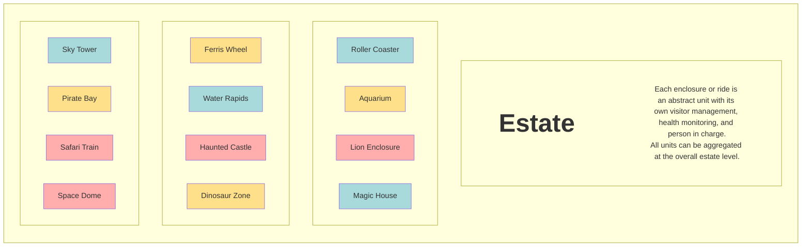
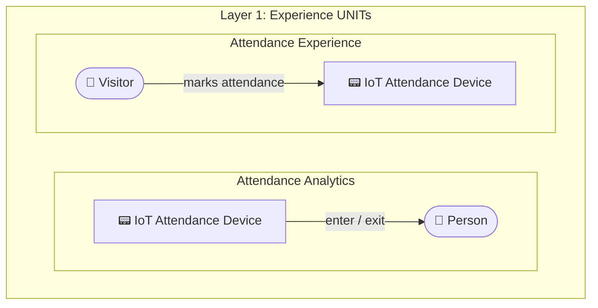
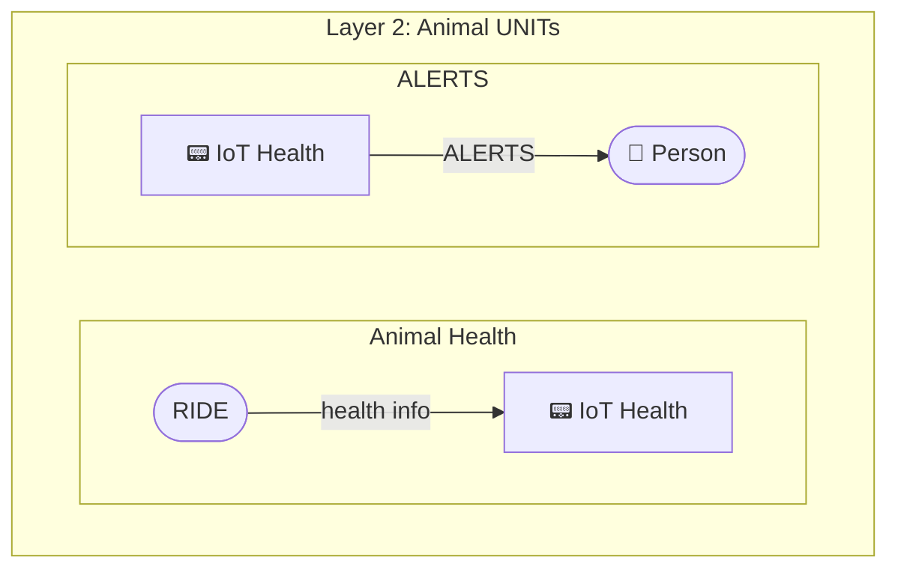
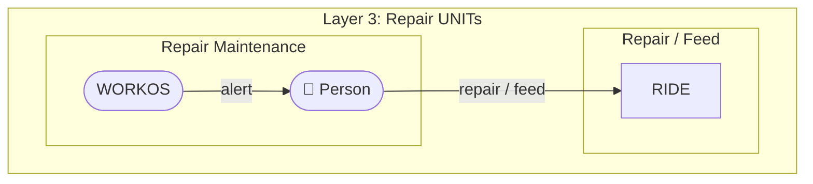

```mermaid
flowchart TD
    subgraph AP[" "]
        direction TB
        subgraph Header[" "]
            direction LR
            ESTATE["Estate"]
            DESC["Each enclosure or ride is an abstract unit with its own visitor management, health monitoring, and person in charge.<br/>All units can be aggregated at the overall estate level."]
            ESTATE --- DESC
        end
        subgraph Row1[" "]
            direction LR
            RC["Roller Coaster"]
            AQ["Aquarium"]
            LE["Lion Enclosure"]
            MH["Magic House"]
        end
        subgraph Row2[" "]
            direction LR
            FW["Ferris Wheel"]
            WR["Water Rapids"]
            HC["Haunted Castle"]
            DZ["Dinosaur Zone"]
        end
        subgraph Row3[" "]
            direction LR
            ST["Sky Tower"]
            PB["Pirate Bay"]
            SA["Safari Train"]
            SD["Space Dome"]
        end
    end

    classDef colorOne fill:#A8DADC
    classDef colorTwo fill:#FFE08A
    classDef colorThree fill:#FFADAD
    classDef description fill:none,stroke:none
    classDef estate fill:none,stroke:none,font-size:150%,font-weight:bold

    linkStyle 0 stroke:transparent,fill:none
    class RC,MH,WR,ST colorOne
    class AQ,FW,DZ,PB colorTwo
    class LE,HC,SA,SD colorThree
    class DESC description
    class ESTATE estate
```

```mermaid
flowchart TB


    subgraph L1["Layer 1: Experience UNITs"]

        direction LR


        %% First subgroup

        subgraph L12["Attendance Analytics"]

            direction LR


            PERSON(["👤 Person"])

            IOT1["📟 IoT Attendance Device"]


            IOT1 -->|enter / exit| PERSON

        end


        %% Second subgroup

        subgraph L11["Attendance Experience"]

            direction LR


            VISITOR(["👤 Visitor"])

            IOT["📟 IoT Attendance Device"]


            VISITOR -->|marks attendance| IOT

        end

    end
```

```mermaid
flowchart TB

    subgraph L1["Layer 2: Animal UNITs"]
        direction LR

        %% First subgroup
        subgraph L12["Animal Health"]
            direction LR

            RIDE(["RIDE"])
            IOT["📟 IoT Health"]

            RIDE -->|health info| IOT
        end
    %% Second subgroup
        subgraph L11["ALERTS"]
            direction LR

            IOT1["📟 IoT Health"]
            PERSON(["👤 Person"])

            IOT1 -->|ALERTS | PERSON
        end
    end
 
```

```mermaid
flowchart LR

    subgraph L1["Layer 3: Repair UNITs"]
        direction LR

        %% First subgroup
        subgraph L1A["Repair Maintenance"]
            direction LR

            WORKOS(["WORKOS"])
            PERSON(["👤 Person"])

            WORKOS -->|alert| PERSON
        end

        %% Second subgroup
        subgraph L1B["Repair / Feed"]
            direction LR

            RIDE["RIDE"]
        end

        %% Continue the sequence
        PERSON -->|repair / feed| RIDE
    end
```