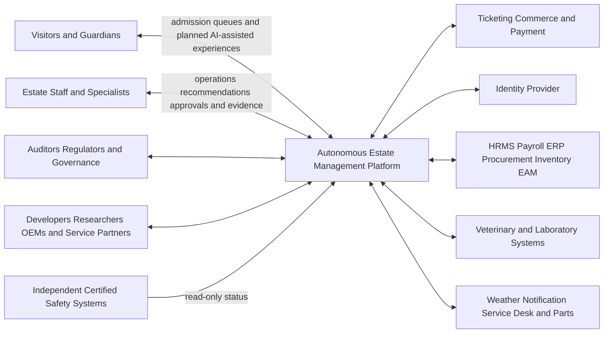

# C1 System Context

| Field | Value |
|---|---|
| Document ID | ARCH-002 |
| Status | Draft |
| Date | 2026-09-16 |
| Implementation | Planned |
| Source | [Solution Overview](../../solution-overview-15thSept.md) |

## Relationships

| External party/system | Purpose | Direction | Protocol | Authority and failure rule |
|---|---|---|---|---|
| Visitors and guardians | Admission, queues, consent, engagement | Bidirectional | Planned applications/APIs | Own requests; platform applies consent and guardian policy. |
| Estate staff and specialists | Plans, tasks, approvals, evidence | Bidirectional | Planned offline-capable applications/APIs | Professional authority remains domain scoped. |
| Governance and ecosystem users | Governed review, export, support | Bidirectional | Purpose-limited API/export/session | No unrestricted raw operational access. |
| External systems | Identity, commerce, enterprise, clinical, weather, notification, service | Bidirectional except safety | See [Integration Specification](../../specifications/integrations-and-contracts.md) | Failures queue, degrade, deny, or use local fallback by contract. |
| Independent safety systems | Certified status only | Into platform | Isolated read-only interface | Never controlled by the platform. |

Owners, directions, protocols, contracts, failure handling, and authority are maintained in the [Integration Specification](../../specifications/integrations-and-contracts.md). Provider timeout and retry settings are defined in adapter configuration before integration acceptance.

## Planned Core AI Capabilities

The following Product 1 capabilities are part of the planned system context, not optional commercial add-ons. They do not claim implementation, approval, release evidence, or Product 2 activation. [ADR-004](../adr/ADR-004-human-controlled-ai.md) governs their common decision boundary.

| Capability | Primary context actors | Planned solution role | Governance boundary |
|---|---|---|---|
| Route and queue assistant | Visitors and guardians; visitor-services colleagues | Suggest an entry itinerary using opening status, queue estimate, accessibility needs, group preferences, weather, and available time. | Recommendations remain optional and consent-bound. Every ride and enclosure remains visible as included or skipped, every skipped item shows the reason, and visitors can select any skipped available item for recalculation unless a deterministic restriction makes it unavailable. |
| Zoo social-media strategist | Marketing, keepers, welfare and safeguarding reviewers | Propose campaign themes, schedules, channel variants, and approved content for events such as births, conservation milestones, or new experiences. | Keeper, welfare, safeguarding, and marketing approval is required before publication; policy permits approved non-sensitive events. |
| Weather-aware experience promotion | Visitors, visitor services, operations, and marketing | Combine weather forecasts with approved historical patterns to recommend suitable indoor, outdoor, ride, or animal-viewing experiences. | Present likely conditions without promising animal behavior; deterministic closure, welfare, and safety rules take precedence. |
| Predictive maintenance and lifecycle insight | Ride and enclosure operators, maintenance technicians, specialists | Prioritize possible maintenance, hardware-failure risk, device battery replacement, and software or firmware update planning. | AI recommends investigation or timing only; qualified staff approve diagnosis, work, rollout, shutdown, and return to service. |
| Affinity-content assistant | Visitors and guardians; keepers, welfare, safeguarding, and marketing reviewers | Draft policy-constrained animal updates, Virtual Pet activities, adoption messages, and Grow Together milestones. | Use only approved public facts and consented profile data; human review applies to welfare-sensitive, child-facing, and public content. |
