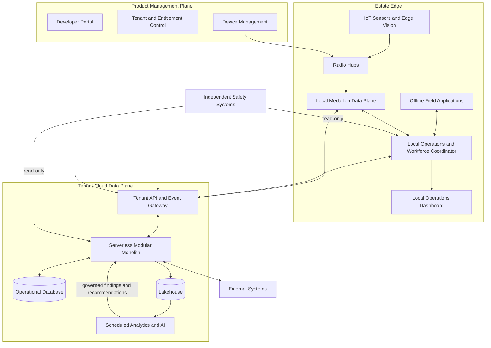

# C2 Containers

| Field | Value |
|---|---|
| Document ID | ARCH-003 |
| Status | Draft |
| Date | 2026-09-16 |
| Implementation | Planned |
| Source | [Solution Overview](../../solution-overview-15thSept.md) |

## Container Responsibilities

| Container | Responsibility | Data | Failure behavior |
|---|---|---|---|
| Devices and radio hubs | Collect signed observations and transport local evidence. | Telemetry and derived vision events | Buffer, quarantine, or degrade coverage. |
| Offline field applications | Execute assigned work and capture evidence. | Scoped tasks, procedures, local outcomes | Continue within authorized local window. |
| Local data plane | Store and promote Bronze/Silver/Gold evidence. | Local operational evidence | Prioritize critical data and replay idempotently. |
| Local coordinator/dashboard | Apply deterministic policy, alerts, plans, and local visibility. | Current unit, alert, plan, and task state | Operate for 72 hours; use safer state. |
| API/event gateway | Authenticate, tenant-scope, version, and route cloud traffic. | API and event envelopes | Reject invalid scope; queue eligible asynchronous traffic. |
| Modular monolith | Coordinate planned domain modules, core AI capability workflows, deterministic policy, human approval, and integrations. | Operational state, workflows, recommendations, approvals, and outcomes | Isolate failed adapters or AI capabilities and preserve local operation. |
| Operational database | Persist current cloud operational state. | Tenant-scoped transactional data | Restore and reconcile; recovery targets are set during delivery. |
| Lakehouse/analytics/AI | Hold approved data, run scheduled analysis and evaluation, and produce governed findings or recommendations. | Approved Silver/Gold data and assurance evidence | Disable AI or defer analytics without suppressing critical local behavior. |
| Management plane | Control tenant, entitlement, developer, device, and lifecycle policy. | Configuration and device metadata | No standing access to sensitive tenant records. |

## Planned Core AI Capability Allocation

All capability allocations are `Planned`. They identify container responsibilities only and do not claim a selected model, provider, implementation, deployment, approval, or verification evidence.

| Capability | Primary containers | Planned flow | Governance and failure boundary |
|---|---|---|---|
| Route and queue assistant | API/event gateway; modular monolith; operational database; lakehouse/analytics/AI | Combine current opening, aggregate queue, accessibility, consented preference, weather, and available-time evidence into an optional itinerary while returning the complete ride and enclosure catalogue with included/skipped state and skip reasons. | The modular monolith keeps skipped available units visitor-selectable and recalculates after selection. Deterministic closure, safety, capacity, entitlement, consent, and human-support rules remain authoritative; disable or use staff fallback when AI is unavailable. |
| Zoo social-media strategist | Modular monolith; operational database; lakehouse/analytics/AI | Produce proposed campaign themes, schedules, variants, and content from approved facts and governed context. | No direct publication path; applicable keeper, welfare, safeguarding, and marketing approvals are required. |
| Weather-aware experience promotion | External systems; modular monolith; operational database; lakehouse/analytics/AI | Ingest weather evidence and combine it with approved historical and current operational data to recommend experiences. | Deterministic closure, welfare, and safety rules take precedence; provider or model failure falls back to approved staff-operated content. |
| Predictive maintenance and lifecycle insight | Local data plane; API/event gateway; modular monolith; lakehouse/analytics/AI | Promote approved operational evidence for failure-risk, battery, maintenance, and update-planning recommendations. | Critical alerts remain local and deterministic. Qualified staff retain diagnosis, work approval, shutdown, rollout, and return-to-service authority. |
| Affinity-content assistant | API/event gateway; modular monolith; operational database; lakehouse/analytics/AI | Draft animal updates and engagement content from approved public facts and consented profile data. | Welfare-sensitive, child-facing, and public content requires applicable human review; disable AI or use staff-authored content on failure. |
