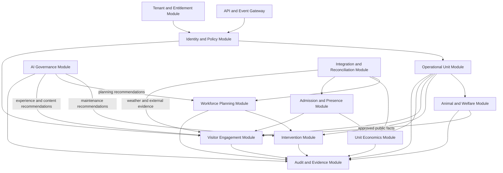

# C3 Components

| Field | Value |
|---|---|
| Document ID | ARCH-004 |
| Status | Draft |
| Date | 2026-09-16 |
| Implementation | Planned |
| Source | [Solution Overview](../../solution-overview-15thSept.md) |

This view decomposes planned responsibilities inside the local coordinator and serverless modular monolith. It is not a code map.

## Planned Components

| Component | Responsibility | Requirements | Failure containment |
|---|---|---|---|
| Identity and Policy | Contextual authorization and elevation | FR-022, SEC-001 to SEC-007 | Deny incomplete or expired authority. |
| Operational Unit | Stable unit identity and linked evidence | FR-001, FR-002 | Preserve identity and history. |
| Animal and Welfare | Subject identity, observation, and welfare context | BR-002, FR-003, FR-048, FR-049, CON-004 | Escalate; clinical authority remains with an authorized professional. |
| Intervention | Alerts, intervention lifecycle, safer state | FR-009 to FR-011 | Deterministic critical handling remains local. |
| Workforce Planning | Constraint-aware plans and versioned re-planning | FR-012 to FR-014 | Escalate unsatisfied mandatory coverage. |
| Admission and Presence | Entitlement evidence, occupancy, queues | FR-015, FR-016, FR-050 | Use local anti-replay and withhold unsafe aggregates. |
| Visitor Engagement | Planned route and queue assistance, weather-aware promotion, affinity engagement, and governed public-content workflows | FR-030 to FR-037 | Withhold unsafe, unapproved, or unsupported output; use deterministic or staff-operated fallback. |
| Unit Economics | Credits, attribution, cost, reconciliation | FR-017 to FR-019, FR-047, NFR-009, NFR-010 | Block duplicates and unbalanced posting. |
| AI Governance | Capability lifecycle, evaluation, recommendation evidence | FR-020, FR-021, FR-033 | Disable and fall back to deterministic or staff process. |
| Integration and Reconciliation | External adapters, authority, inbox/outbox, resolution | FR-004, FR-005 | Isolate adapter, queue, reconcile. |
| Tenant and Entitlement | Tenant scope, edition, deployment policy | FR-006, NFR-005, NFR-006 | Reject missing tenant scope. |
| Audit and Evidence | Append-only business evidence and provenance | Cross-cutting | Preserve original and correction records. |

Detailed interfaces are defined during implementation and governed by the [Domain Model](../../specifications/domain-model.md).

## Planned Core AI Capability Collaboration

The capabilities below are logical collaborations among planned components. They do not represent implemented code, selected models or providers, approved release criteria, or verification evidence.

| Capability | Collaborating components | Planned solution role | Governance and failure boundary |
|---|---|---|---|
| Route and queue assistant | Admission and Presence; Visitor Engagement; AI Governance; Identity and Policy; Audit and Evidence | Produce an optional itinerary and a complete ride and enclosure catalogue that records included/skipped state, skip reason, and visitor selectability. | Visitors can select any skipped available unit and trigger itinerary recalculation. Deterministic closure, safety, capacity, entitlement, accessibility, and consent policy remain authoritative. |
| Zoo social-media strategist | Visitor Engagement; AI Governance; Animal and Welfare; Identity and Policy; Audit and Evidence | Draft campaign themes, schedules, variants, and content from approved facts. | No direct publication action; applicable keeper, welfare, safeguarding, and marketing approvals are required. |
| Weather-aware experience promotion | Integration and Reconciliation; Admission and Presence; Visitor Engagement; AI Governance; Audit and Evidence | Combine external weather evidence with approved historical and current operational context to recommend experiences. | Deterministic closure, welfare, and safety rules take precedence; use approved staff-operated fallback on missing or failed AI evidence. |
| Predictive maintenance and lifecycle insight | Operational Unit; Intervention; AI Governance; Integration and Reconciliation; Audit and Evidence | Prioritize investigation, maintenance, battery replacement, and software or firmware update planning. | AI cannot diagnose, approve work, authorize shutdown, control rollout, or return a unit to service; qualified staff retain those decisions. |
| Affinity-content assistant | Visitor Engagement; Animal and Welfare; AI Governance; Identity and Policy; Audit and Evidence | Draft policy-constrained animal updates, Virtual Pet activities, adoption messages, and Grow Together milestones. | Use approved public facts and consented profile data; applicable human review is required for welfare-sensitive, child-facing, and public content. |
