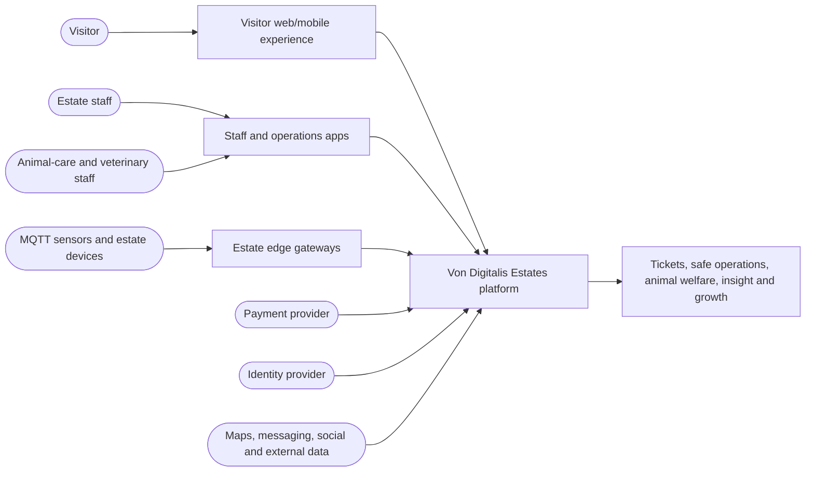
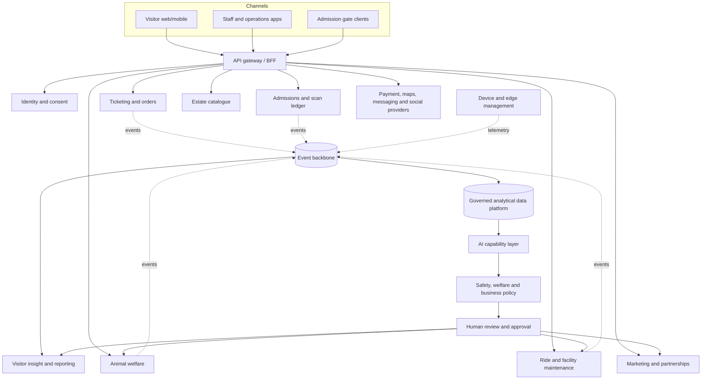
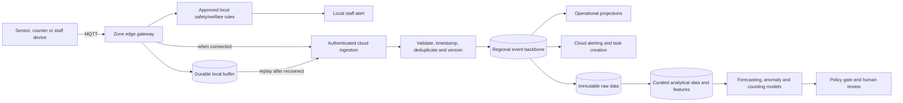
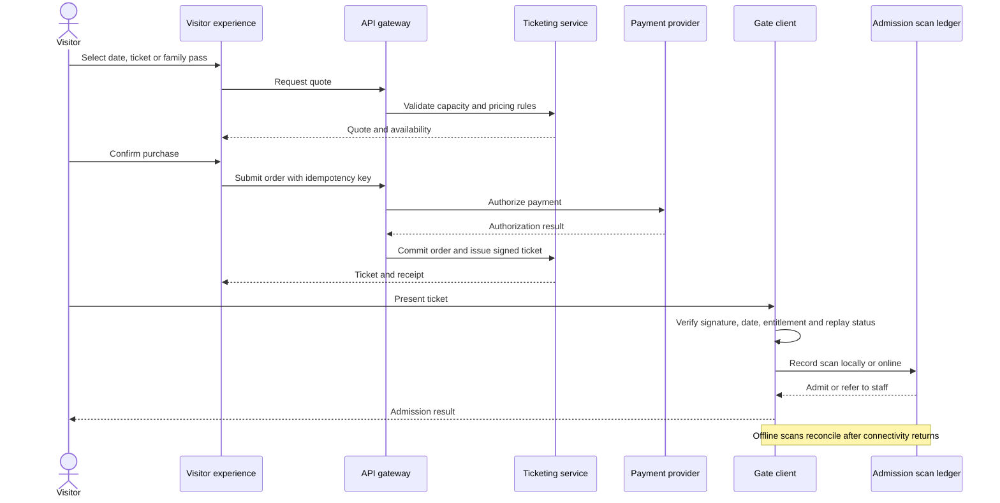
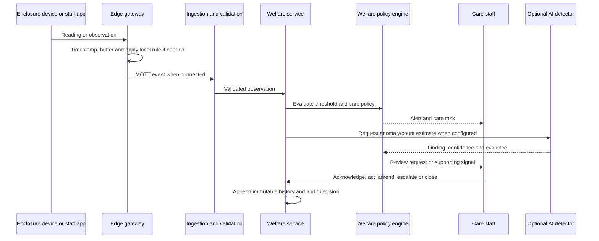
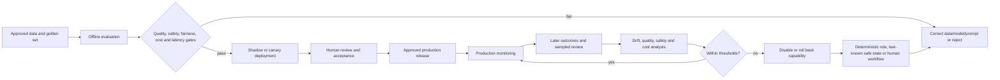

# Von Digitalis Estates — Architecture Diagrams

These diagrams are the first visual baseline for the architecture proposal. They use the following notation:

- Rounded boxes represent people or external systems.
- Rectangles represent application services or processing components.
- Cylinders represent persistent stores.
- Dashed arrows represent asynchronous events or eventual consistency.
- AI output is advisory until it passes a deterministic policy gate and, where required, human review.

## 1. System context

## 2. Container view

## 3. Edge-to-cloud data flow

## 4. Ticket purchase and offline admission

## 5. Animal-welfare alert

## 6. AI evaluation and production control

## 7. Diagram review questions

- Are the boundaries between ticketing, admissions, payment, and identity clear enough to prevent inconsistent ownership?
- Is the edge gateway capable of the required offline window and local alert behavior?
- Which welfare and ride signals must be local and which may wait for cloud processing?
- Are aggregated visitor insights sufficient without collecting unnecessary individual movement data?
- Does every AI path show a fallback, evidence, monitoring, and an accountable decision maker?
