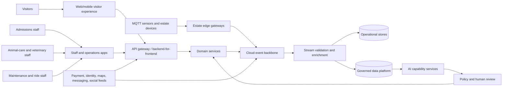

# Von Digitalis Estates — Initial Architecture Proposal

## 1. Proposal summary

Use a resilient edge-to-cloud platform with clear separation between commerce, estate operations, animal welfare, maintenance, analytics, and AI capabilities. Put safety, ticket validity, payments, and care workflows behind deterministic domain services. Use AI for anomaly detection, forecasting, feedback insight, visitor-growth recommendations, and assisted content—but place policy gates and human approval between model output and consequential action.

The patchy Wi-Fi constraint makes estate gateways a first-class architectural boundary. They must authenticate devices, buffer telemetry locally, execute a small approved set of safe local rules, and synchronize reliably with the cloud.

## 2. Architectural drivers

- Grow from 5,000 to at least 15,000 daily visitors without losing operational visibility.
- Support ticket purchase and admissions with strong correctness and offline tolerance.
- Protect ride safety and animal welfare; stale or uncertain data must be visible.
- Provide useful near-real-time alerts despite patchy Wi-Fi.
- Give managers evidence for staffing, maintenance, investment, and profitability decisions.
- Use AI where it creates leverage while controlling nondeterminism, cost, bias, and provider change.
- Preserve historical records and provenance for audits, welfare review, incidents, and disputes.

## 3. System context

## 4. Proposed bounded contexts and containers

| Context/container | Responsibility | System of record |
|---|---|---|
| Visitor identity and consent | Accounts, roles, consent, preferences, privacy requests. | Identity/consent store. |
| Ticketing and orders | Products, family passes, capacity, orders, entitlements, refunds, ticket lifecycle. | Transactional commerce database. |
| Admissions | Ticket validation, gate devices, scans, exceptions, offline reconciliation. | Admission scan ledger. |
| Estate catalogue | Rides, displays, enclosures, facilities, maps, schedules, accessibility information. | Estate catalogue database. |
| Visitor insight | Aggregated visits, flows, dwell, popularity, queues, feedback, survey analysis. | Analytical store; source events retained. |
| Ride and facility maintenance | Assets, inspections, safety state, defects, work orders, downtime, cost. | Maintenance database. |
| Animal welfare | Animal/group profiles, enclosure, health, feeding, veterinary observations, population history, care tasks. | Welfare database with immutable history. |
| Device and edge management | Device identity, configuration, gateway health, buffering, telemetry ingestion, data quality. | Device registry plus event log. |
| Marketing and partnerships | Campaigns, offers, influencers, referral codes, content approvals, attribution. | Marketing database. |
| AI capability layer | Forecasting, anomaly detection, counting, classification, summarization, recommendations, assistant tools. | Model/prompt registry and inference audit, not business truth. |
| Data and MLOps platform | Raw/curated data, lineage, features, evaluation, model registry, monitoring, cost. | Governed lakehouse/warehouse. |

## 5. Edge and connectivity design

Each estate zone has an edge gateway connected to MQTT-capable sensors and counters. Gateways should:

- use per-device identity and certificate-based authentication;
- validate message shape and units before accepting data;
- add gateway, device, event, and sequence metadata;
- buffer durable messages during Wi-Fi/cloud outages;
- deduplicate and replay messages after reconnection;
- run only approved local rules for immediate safety/welfare alerts;
- expose local health and backlog status to staff;
- receive signed configuration with version, expiry, and rollback.

Cloud ingestion should treat event time and ingestion time separately. Late, duplicate, missing, or out-of-order events must be observable rather than silently normalized away.

## 6. Data and event architecture

Use versioned events such as `OrderPaid`, `TicketIssued`, `TicketScanned`, `VisitorAreaEntered`, `FeedbackSubmitted`, `RideInspectionFailed`, `MaintenanceWorkOrderOpened`, `AnimalObservationRecorded`, `FeedingRecorded`, `PopulationCountRecorded`, `EnclosureReadingReceived`, and `AIRecommendationCreated`.

- Transactional services publish through an outbox or equivalent reliable pattern.
- Consumers are idempotent and retain event IDs, source identity, and processing status.
- Operational stores serve current dashboards and workflows; the analytical platform serves trends and models.
- Store raw immutable telemetry/images/feedback separately from curated datasets.
- Apply schema compatibility rules, dead-letter queues, replay tooling, and data-quality dashboards.
- Keep personal identifiers separated from aggregated movement analytics and enforce purpose/retention controls.

## 7. Critical flows

### Ticket purchase and admission

`Visitor → API/BFF → Ticketing → Payment provider → Order commit → Ticket issuance → Admissions app/gate → Scan ledger`

Ticketing owns entitlement and validity. Gate clients cache signed ticket verification material and a bounded set of valid tickets for offline use. Reconciliation resolves duplicate scans and exceptions through a staff workflow.

### Animal welfare monitoring

`Sensor/staff app → Edge or API → Event backbone → Welfare projection → Rule alert → Care task → Staff acknowledgement/action → Welfare history`

AI anomaly detection may supplement configured rules but cannot suppress a safety or welfare alert without an explicit approved policy.

### Ride maintenance

`Inspection/device signal → Maintenance service → Safety policy evaluation → Open/close ride status → Work order → Repair evidence → Authorized return-to-service`

The public catalogue and admissions experience consume the published ride status; they do not infer safety from raw sensor data.

### Popularity and investment insight

`Scans/counters/app/feedback → Aggregation → Analytical model → Dashboard and forecast → Manager decision → Experiment or work item`

All dashboard metrics show time range, freshness, sample size, and known data gaps. AI recommendations link to the evidence used and allow rejection or annotation.

## 8. AI architecture and evaluation

### Candidate AI capabilities

- Feedback classification, summarization, and action extraction.
- Visitor-demand and area-popularity forecasting.
- Animal counting and welfare anomaly detection from images/video/sensors.
- Maintenance anomaly and failure-risk prioritization.
- Campaign/content/partnership suggestions.
- Visitor assistant for estate information, wayfinding, and offers.

### Safety pattern

`Approved data → versioned prompt/model → capability API → confidence/evidence → deterministic policy gate → human review or action → audit`

Models do not directly issue refunds, declare a ride safe, prescribe animal treatment, change population records, or publish marketing content.

### Evaluation plan

For each AI capability, maintain a versioned golden set and measure task-specific quality:

- counting: precision, recall, count error, and human agreement;
- anomaly detection: recall of known incidents, false-alert rate, lead time;
- feedback: classification F1, summary factuality, action extraction accuracy;
- forecasting: MAE/MAPE by area and season, calibration, and business impact;
- assistant: grounded-answer rate, refusal correctness, unsafe-answer rate, and human rating;
- all use cases: latency, cost, failure rate, drift, subgroup performance, and override rate.

Release gates require minimum quality, no critical safety regression, acceptable cost/latency, and human sign-off. Production monitoring samples outputs for review, compares predictions with later outcomes, detects distribution/model/provider changes, and supports disablement and rollback.

## 9. Deployment and resilience

Use a cloud region selected for legal and operational requirements, with multi-zone managed services and a tested recovery environment. Run APIs and stateless workers on managed containers. Use a managed event backbone, relational stores for transactional contexts, object storage for evidence/raw data, and a warehouse/lakehouse for analytics and ML.

The estate edge remains functional during cloud outages for offline admissions verification, buffering, device health, and approved local alerts. Cloud-dependent functions—new ticket purchase, broad analytics, model inference, and campaign publication—must show degraded state and recover safely.

## 10. Security, privacy, and governance

- Role-based access with stronger controls for finance, welfare, veterinary, and safety actions.
- Encryption in transit and at rest; managed secrets and device certificates.
- Audit every ticket/refund, safety decision, welfare amendment, AI inference, human review, and configuration change.
- Minimize visitor movement data, aggregate wherever possible, capture consent where required, and enforce retention/deletion.
- Restrict animal records and sensitive welfare/veterinary information to authorized roles.
- Use signed uploads and malware/content checks for images and evidence.
- Apply API/device rate limits, network segmentation, backup, disaster recovery, and incident runbooks.

## 11. Quality attributes and measurable starting targets

| Attribute | Initial target/response |
|---|---|
| Ticketing correctness | No duplicate ticket validity or double refund; idempotent order/payment operations. |
| Admission resilience | Validate previously issued tickets for a configured offline window; synchronize without data loss. |
| Alert timeliness | Critical connected alerts visible within a defined target, with freshness shown when data is stale. |
| Scalability | Baseline for 15,000 daily visitors, then load-test peak entry/search and event traffic with headroom. |
| Safety | No AI-only safety or welfare action; deterministic policy and human escalation for consequential decisions. |
| Operability | End-to-end correlation IDs, device lag/backlog metrics, business SLOs, and incident dashboards. |
| Cost control | Budget per inference/use case, cost-per-order/visitor metrics, batching for non-urgent analytics. |
| Evolvability | Versioned APIs/events, provider adapters, model abstraction, and feature flags. |

## 12. Delivery roadmap

1. **Foundation:** identity, catalogue, ticketing/payment, digital tickets, admissions, edge/device registry, and observability.
2. **Operational safety:** ride inspections/work orders, animal profiles/feeding/health, enclosure readings, rules-based alerts, offline staff workflows.
3. **Insight:** visitor flow/popularity, feedback, maintenance dashboards, revenue/cost reporting, and demand forecasting baseline.
4. **AI augmentation:** feedback insight, animal counting/anomaly detection, maintenance prioritization, visitor assistant, and marketing recommendations.
5. **Optimization:** experiments, packages, partnerships, forecasting-driven staffing/investment, and broader sensor coverage.

## 13. First architecture decisions to record as ADRs

- Edge gateway and MQTT protocol/security model.
- Ticket validity and offline admission reconciliation.
- Transactional boundaries and event delivery pattern.
- Welfare and ride safety data ownership and audit model.
- Visitor movement privacy and aggregation approach.
- AI model/provider abstraction and evaluation gates.
- Human-in-the-loop policy for animal, safety, finance, and public-content decisions.
- Data retention, residency, backup, and disaster recovery strategy.
