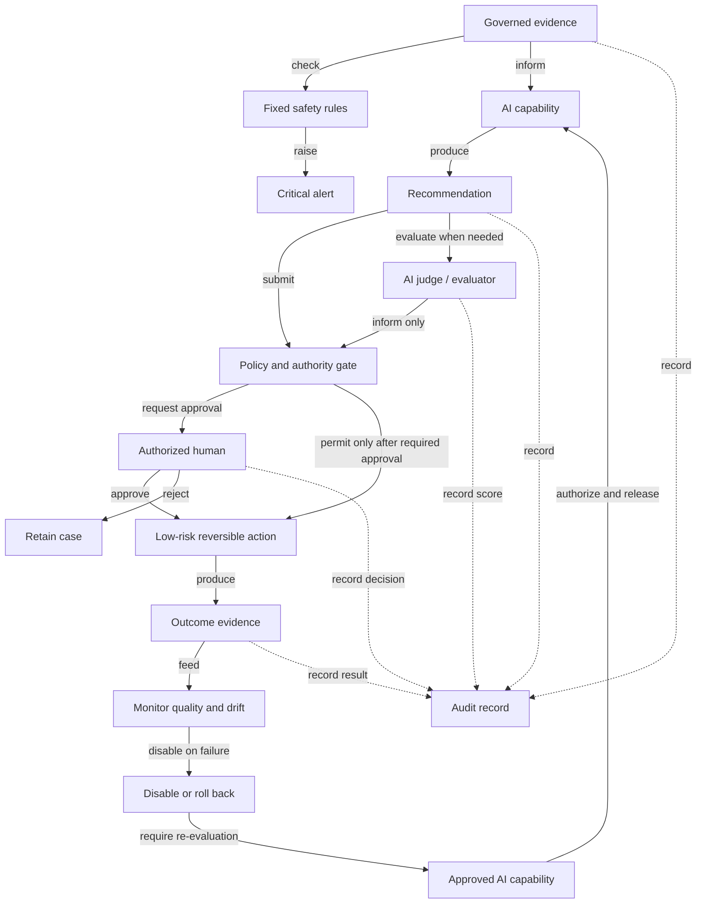

# AI and Decisioning View

| Field | Value |
|---|---|
| Document ID | ARCH-010 |
| Status | Draft |
| Date | 2026-09-15 |
| Implementation | Planned |
| Source | [Solution Overview](../../solution-overview-15thSept.md) |

## Evidence Retention

This view shows what must be recorded, but it does not define retention periods. Retention, deletion, legal hold, and purpose rules are defined in the [Data and Retention Specification](../../specifications/data-and-retention.md). AI recommendations, judge scores, human decisions, outcomes, and rollback records follow those rules.

## Decision Precedence

1. Independent certified safety status and deterministic safety/welfare policy.
2. Authorized professional decision.
3. Governed AI recommendation.
4. Commercial or optimization preference.

Lower levels cannot override higher levels.

## Isolation

Natural-language input is isolated and sanitized before model processing. Model output cannot invoke consequential tools directly. The action executor accepts only a versioned policy decision, authorized identity where required, and a declared action catalog entry.

## Failure Modes

| Failure | Response |
|---|---|
| Model/provider unavailable | Deterministic or staff-operated fallback. |
| Missing or stale evidence | No approval; request evidence or human review. |
| Prompt injection or policy breach | Reject, audit, and optionally disable capability. |
| Drift or evaluation threshold breach | Stop promotion or disable/roll back. |
| Judge disagreement | Qualified human review; never default to approval. |

Thresholds and owners are configured at the AI release gate. Requirements: FR-020 to FR-022, FR-033, CON-004.
