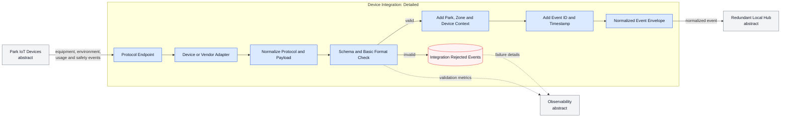
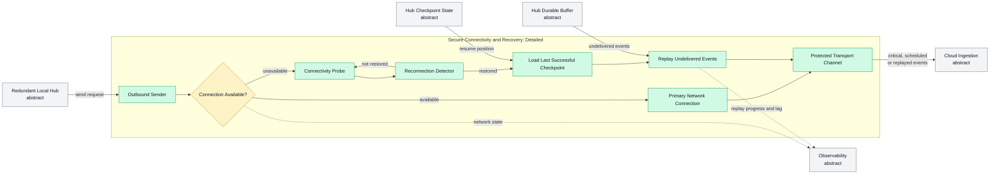
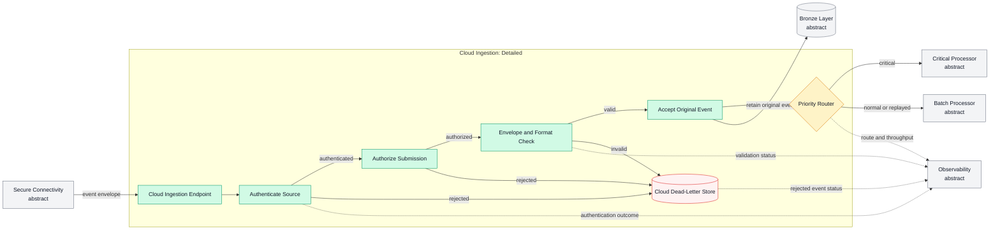
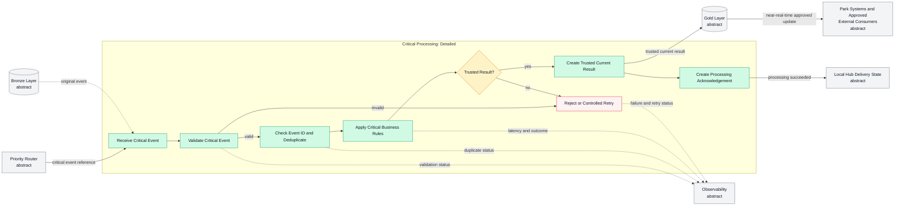
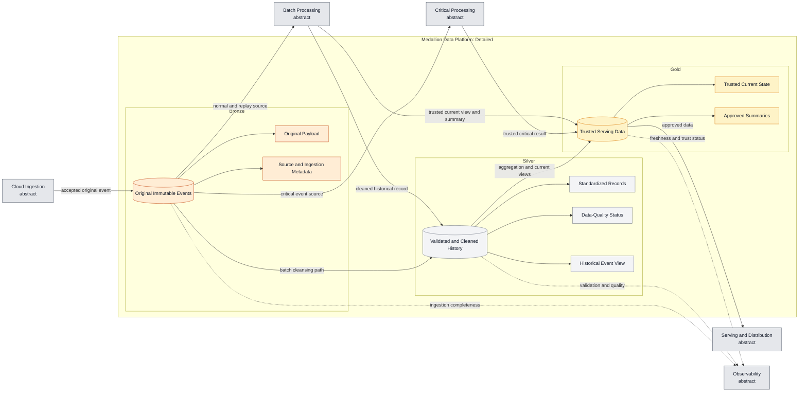
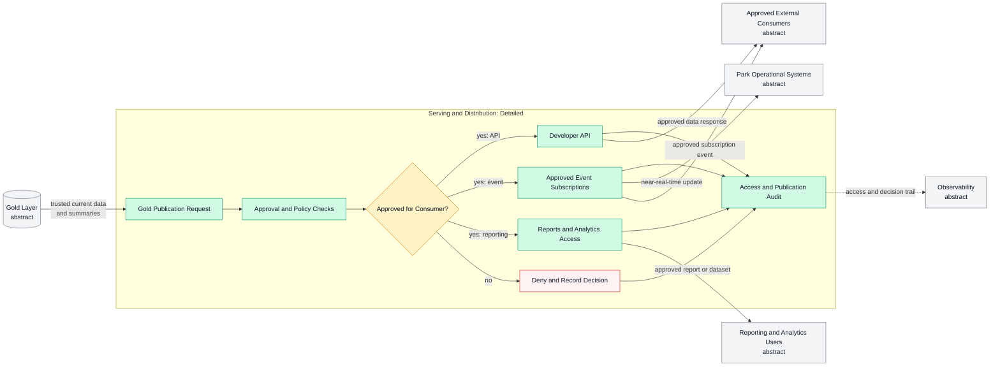
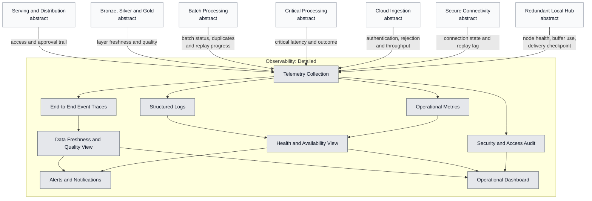

# IoT Data Processing Architecture: Hierarchical Component Views

## Purpose

This document presents the IoT data-processing architecture in two levels:

1. A **high-level end-to-end view** showing the major components and their communication.
2. A set of **component-focused views** where one component is expanded in detail and the surrounding components remain abstract. This preserves end-to-end context while making each diagram readable during architecture reviews.

> **Source-aligned behavior:** redundant local hubs, store-before-forwarding, critical and scheduled paths, at least 72 hours of local buffering, checkpoint-based replay, Bronze/Silver/Gold data layers, and approved Gold-data distribution.
>
> **Proposed elaborations:** event identity, delivery envelopes, dead-letter flows, authentication, acknowledgements, detailed observability, and policy controls are recommended design details rather than explicit source requirements.

---

## 1. High-level end-to-end architecture

This is the abstract overview. It intentionally hides internal implementation details and shows only the important architectural components and communication paths.

```mermaid
flowchart LR
    DEVICES["Park IoT Devices"]
    INTEGRATION["Device Integration"]
    EDGE["Redundant Local Hub"]
    BUFFER[("Durable Edge Buffer<br/>at least 72 hours")]
    NETWORK["Secure Edge-to-Cloud<br/>Connectivity"]
    INGESTION["Cloud Ingestion"]
    PROCESSING["Critical and Batch<br/>Processing"]
    DATA[("Bronze, Silver and Gold<br/>Data Platform")]
    SERVING["Serving and Distribution"]
    CONSUMERS["Park Systems and<br/>Approved Consumers"]
    OBSERVE["Monitoring, Audit<br/>and Alerting"]

    DEVICES -->|"device readings and events"| INTEGRATION
    INTEGRATION -->|"normalized events"| EDGE
    EDGE -->|"store before forwarding"| BUFFER
    BUFFER -->|"critical immediately<br/>normal on schedule<br/>replay after reconnect"| NETWORK
    NETWORK -->|"authenticated transport"| INGESTION
    INGESTION -->|"accepted original events"| DATA
    INGESTION -->|"priority route"| PROCESSING
    PROCESSING -->|"validated and trusted results"| DATA
    DATA -->|"approved Gold data"| SERVING
    SERVING -->|"API, events and reports"| CONSUMERS

    EDGE -. "health, capacity and delivery state" .-> OBSERVE
    NETWORK -. "availability and replay status" .-> OBSERVE
    INGESTION -. "authentication and ingestion status" .-> OBSERVE
    PROCESSING -. "latency, failures and quality" .-> OBSERVE
    DATA -. "freshness and quality" .-> OBSERVE
    SERVING -. "access and audit trail" .-> OBSERVE

    PROCESSING -->|"processing acknowledgement"| EDGE

    classDef edge fill:#E8F1FF,stroke:#2563EB,color:#111827;
    classDef cloud fill:#ECFDF5,stroke:#059669,color:#111827;
    classDef data fill:#FFF7ED,stroke:#EA580C,color:#111827;
    classDef consumer fill:#F5F3FF,stroke:#7C3AED,color:#111827;
    classDef observe fill:#F3F4F6,stroke:#4B5563,color:#111827;

    class DEVICES,INTEGRATION,EDGE edge;
    class NETWORK,INGESTION,PROCESSING,SERVING cloud;
    class BUFFER,DATA data;
    class CONSUMERS consumer;
    class OBSERVE observe;
```

### Major communication paths

| From | To | Communication |
|---|---|---|
| Park IoT Devices | Device Integration | Raw readings and operational events |
| Device Integration | Redundant Local Hub | Normalized and enriched events |
| Local Hub | Durable Edge Buffer | Durable write before forwarding |
| Durable Edge Buffer | Secure Connectivity | Immediate critical events, scheduled normal data, and replayed events |
| Secure Connectivity | Cloud Ingestion | Protected branch-to-cloud transport |
| Cloud Ingestion | Data Platform | Original accepted events retained in Bronze |
| Cloud Ingestion | Processing | Critical or batch route based on priority |
| Processing | Data Platform | Trusted results and cleaned history |
| Data Platform | Serving | Approved Gold data |
| Serving | Consumers | APIs, subscriptions, operational updates, and reports |
| Cloud Processing | Local Hub | Successful-processing acknowledgement |

---

# Component-focused views

## 2. Device Integration detailed view

**Expanded component:** Device Integration  
**Abstract surroundings:** Park devices and Redundant Local Hub

### Component responsibility

- Accept device and vendor-specific protocols.
- Normalize payloads into a common event structure.
- perform basic schema and format validation.
- Add park, zone, device, event identity, and timestamp context.
- Send one normalized event stream to the local hub.

---

## 3. Redundant Local Hub detailed view

**Expanded component:** Redundant Local Hub  
**Abstract surroundings:** Device Integration, Secure Connectivity, Cloud Processing, and Observability

```mermaid
flowchart LR
    INTEGRATION["Device Integration<br/>abstract"]

    subgraph HUB["Redundant Local Hub: Detailed"]
        ENDPOINT["Hub Service Endpoint"]

        subgraph HA["High Availability"]
            HEALTH["Health Monitor"]
            FAILOVER["Failover Controller"]
            NODE_A["Hub Node A"]
            NODE_B["Hub Node B"]
            ACTIVE["Selected Active Processing"]

            HEALTH --> FAILOVER
            HEALTH -. "health check" .-> NODE_A
            HEALTH -. "health check" .-> NODE_B
            FAILOVER -->|"select healthy node"| ACTIVE
            NODE_A -. "eligible" .-> ACTIVE
            NODE_B -. "eligible" .-> ACTIVE
        end

        VALIDATE["Validate Event"]
        CLASSIFY{"Priority Classification"}
        ENVELOPE["Create Delivery Envelope"]
        PERSIST["Durable Write"]
        BUFFER[("Local Buffer<br/>at least 72 hours")]
        REJECT[("Local Rejected Event Store")]
        DELIVERY["Delivery Scheduler"]
        CHECKPOINT["Checkpoint and Delivery State"]
        ACK["Acknowledgement Handler"]

        ENDPOINT --> ACTIVE
        ACTIVE --> VALIDATE
        VALIDATE -->|"valid"| CLASSIFY
        VALIDATE -->|"invalid"| REJECT
        CLASSIFY --> ENVELOPE
        ENVELOPE --> PERSIST
        PERSIST --> BUFFER
        BUFFER --> DELIVERY
        BUFFER --> CHECKPOINT
        ACK --> CHECKPOINT
        CHECKPOINT -->|"mark acknowledged range delivered"| BUFFER
    end

    NETWORK["Secure Connectivity<br/>abstract"]
    CLOUD["Cloud Processing<br/>abstract"]
    OBSERVE["Observability<br/>abstract"]

    INTEGRATION -->|"normalized events"| ENDPOINT
    DELIVERY -->|"critical now,<br/>normal on schedule,<br/>replay after reconnect"| NETWORK
    NETWORK --> CLOUD
    CLOUD -->|"processing acknowledgement"| ACK

    HEALTH -. "node health" .-> OBSERVE
    BUFFER -. "capacity and backlog" .-> OBSERVE
    CHECKPOINT -. "delivery and replay state" .-> OBSERVE
    REJECT -. "validation failures" .-> OBSERVE

    classDef focus fill:#DBEAFE,stroke:#1D4ED8,color:#111827;
    classDef abstract fill:#F3F4F6,stroke:#6B7280,color:#111827;
    classDef data fill:#FFF7ED,stroke:#EA580C,color:#111827;
    classDef error fill:#FEF2F2,stroke:#DC2626,color:#111827;
    classDef decision fill:#FEF3C7,stroke:#D97706,color:#111827;

    class ENDPOINT,HEALTH,FAILOVER,NODE_A,NODE_B,ACTIVE,VALIDATE,ENVELOPE,PERSIST,DELIVERY,CHECKPOINT,ACK focus;
    class INTEGRATION,NETWORK,CLOUD,OBSERVE abstract;
    class BUFFER data;
    class REJECT error;
    class CLASSIFY decision;
```

### Component responsibility

- Present a single service endpoint while operating two hub nodes.
- Select one healthy node for active processing.
- Validate and classify events.
- Persist each event before forwarding.
- Retain at least 72 hours of expected data.
- Track delivery progress and process cloud acknowledgements.
- Replay undelivered events after reconnection.

### Design decision still required

The durable-buffer topology must be defined. The implementation may use shared storage, replicated node-local storage, or another durable arrangement. The selected option determines failover consistency, checkpoint ownership, and duplicate risk.

---

## 4. Secure connectivity and recovery detailed view

**Expanded component:** Secure Edge-to-Cloud Connectivity  
**Abstract surroundings:** Local Hub and Cloud Ingestion

### Component responsibility

- Send critical events immediately when connectivity is available.
- Send normal events according to the scheduled path.
- Detect loss and restoration of connectivity.
- Resume from the last successful checkpoint.
- Replay the undelivered range through the same protected transport channel.

---

## 5. Cloud Ingestion detailed view

**Expanded component:** Cloud Ingestion  
**Abstract surroundings:** Connectivity, Processing, Bronze, and Observability

### Component responsibility

- Receive event envelopes from the edge connection.
- Authenticate the source and authorize submission.
- Check the envelope and basic format.
- Retain the accepted original event in Bronze.
- Route critical events to critical processing.
- Route normal and replayed events to batch processing.
- Quarantine rejected cloud-ingestion events.

---

## 6. Critical Processing detailed view

**Expanded component:** Critical Processing  
**Abstract surroundings:** Priority Router, Bronze, Gold, Hub, Consumers, and Observability

### Component responsibility

- Validate critical events.
- Remove duplicates before applying critical rules.
- Produce a trusted current result for Gold.
- Return successful-processing acknowledgement to the edge delivery state.
- Record failures for controlled retry or rejection.

---

## 7. Batch Processing detailed view

**Expanded component:** Batch Processing  
**Abstract surroundings:** Priority Router, Bronze, Silver, Gold, Hub, Consumers, and Observability

```mermaid
flowchart LR
    ROUTER["Priority Router<br/>abstract"]
    BRONZE[("Bronze Layer<br/>abstract")]

    subgraph BATCH["Batch Processing: Detailed"]
        READ["Read Scheduled or Replayed Batch"]
        VALIDATE["Validate Records"]
        DEDUP["Deduplicate by Event Identity"]
        CLEAN["Clean and Standardize"]
        HISTORY["Build Historical Records"]
        CURRENT["Create Current-State Views"]
        SUMMARY["Create Scheduled Summaries"]
        FAILURE[("Batch Rejected Records")]
        ACK["Create Batch Acknowledgement"]

        READ --> VALIDATE
        VALIDATE -->|"valid"| DEDUP
        VALIDATE -->|"invalid"| FAILURE
        DEDUP --> CLEAN
        CLEAN --> HISTORY
        HISTORY --> CURRENT
        HISTORY --> SUMMARY
        CURRENT --> ACK
        SUMMARY --> ACK
    end

    SILVER[("Silver Layer<br/>abstract")]
    GOLD[("Gold Layer<br/>abstract")]
    HUB["Hub Checkpoint State<br/>abstract"]
    CONSUMERS["Reports and Approved<br/>Consumers<br/>abstract"]
    OBSERVE["Observability<br/>abstract"]

    ROUTER -->|"normal or replayed events"| READ
    BRONZE -. "original event batch" .-> READ
    HISTORY -->|"cleaned history"| SILVER
    SILVER -. "validated history" .-> CURRENT
    SILVER -. "validated history" .-> SUMMARY
    CURRENT -->|"trusted current view"| GOLD
    SUMMARY -->|"trusted summaries"| GOLD
    GOLD -->|"approved scheduled output"| CONSUMERS
    ACK -->|"advance checkpoint"| HUB

    VALIDATE -. "quality results" .-> OBSERVE
    DEDUP -. "duplicate metrics" .-> OBSERVE
    FAILURE -. "rejected records" .-> OBSERVE
    ACK -. "batch outcome and replay lag" .-> OBSERVE

    classDef focus fill:#D1FAE5,stroke:#059669,color:#111827;
    classDef abstract fill:#F3F4F6,stroke:#6B7280,color:#111827;
    classDef error fill:#FEF2F2,stroke:#DC2626,color:#111827;

    class READ,VALIDATE,DEDUP,CLEAN,HISTORY,CURRENT,SUMMARY,ACK focus;
    class ROUTER,BRONZE,SILVER,GOLD,HUB,CONSUMERS,OBSERVE abstract;
    class FAILURE error;
```

### Component responsibility

- Read scheduled and replayed batches.
- Validate and deduplicate records.
- Clean events and build historical records in Silver.
- Produce current-state views and summaries in Gold.
- Acknowledge successful processing so the local checkpoint can advance.

---

## 8. Medallion Data Platform detailed view

**Expanded component:** Bronze, Silver, and Gold Data Platform  
**Abstract surroundings:** Cloud Ingestion, Processing, Serving, and Observability

### Component responsibility

- **Bronze:** retain the original accepted event and its ingestion context.
- **Silver:** retain validated, standardized, and cleaned historical data.
- **Gold:** retain trusted current data and summaries for controlled serving.
- Support the fast critical route to Gold and the historical batch route through Silver to Gold.

---

## 9. Serving and Distribution detailed view

**Expanded component:** Serving and Distribution  
**Abstract surroundings:** Gold, Consumers, and Observability

### Component responsibility

- Apply approval and policy checks before publishing Gold data.
- Expose approved data through the Developer API.
- Deliver approved event subscriptions to park systems and external consumers.
- Provide controlled reporting and analytics access.
- Record publication, access, approval, and denial decisions.

---

## 10. Observability detailed view

**Expanded component:** Monitoring, Audit, Metrics, and Alerting  
**Abstract surroundings:** All operational architecture components

### Proposed monitoring coverage

- Hub-node health and failover status
- Buffer utilization and expected remaining capacity
- Network state and time since disconnection
- Replay backlog, progress, and lag
- Authentication and ingestion rejection outcomes
- Critical-event processing latency and status
- Batch status, duplicate detection, and rejected records
- Bronze ingestion completeness
- Silver data-quality status
- Gold freshness and trusted-output status
- Serving approval, access, and audit history

---