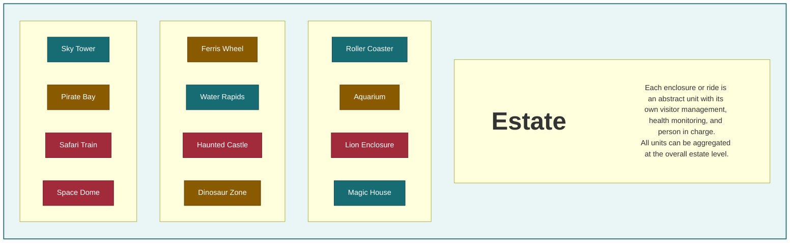
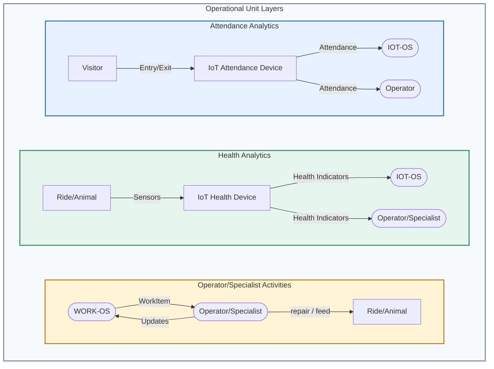
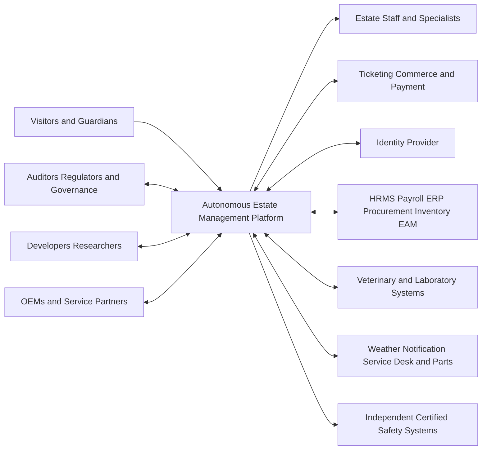

# Diagram Source Backup

This file preserves the editable Mermaid source for the PNG diagrams embedded in the root [README](../README.md). The PNG files are the presentation assets; these definitions are retained as backup source.

| Diagram | PNG |
|---|---|
| Estate as Operational Units | [Estate-as-Units.png](./Estate-as-Units.png) |
| Operational Unit Evidence Flow | [Unit-Economics.png](./Unit-Economics.png) |
| Actors and Access Model | [Roles.png](./Roles.png) |

## Estate as Operational Units

## Operational Unit Evidence Flow

## Actors and Access Model

