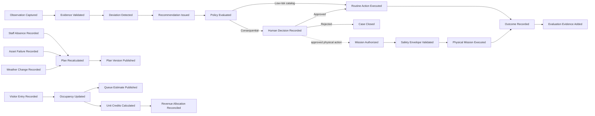

# Big-Picture EventStorming

| Field | Value |
|---|---|
| Document ID | ES-001 |
| Status | Draft |
| Date | 2026-09-15 |
| Source | [Solution Overview](../../solution-overview-15thSept.md) |

This model is a proposed domain discovery view. It does not assert implemented services or approved event contracts.

## Timeline Boundaries

| Phase | Start event | End event | Primary contexts |
|---|---|---|---|
| Observe and respond | Observation Captured | Outcome Recorded | Edge Telemetry, Intervention, Animal and Population, Operational Unit |
| Plan and execute | Trigger Recorded | Plan Version Published | Workforce Planning, Maintenance |
| Visit and attribute | Admission Validated | Revenue Allocation Reconciled | Admission, Visitor Presence, Unit Economics |
| Govern AI | Capability Proposed | Capability Disabled or Promoted | AI Governance, Identity and Policy |
| Execute physical mission | Mission Requested | Mission Accepted or Exception Recorded | Autonomous Fleet, Intervention |

## Pivotal Events

- `CriticalAlertRaised` starts deterministic local escalation.
- `PlanVersionPublished` changes authorized field work.
- `UnitAvailabilityChanged` affects operations, visitors, and attribution.
- `HumanDecisionRecorded` is required before consequential execution.
- `MissionAuthorityLost` requires an independent safe state.
- `ReconciliationConflictDetected` prevents silent source-of-truth overwrite.

Detailed definitions are in [Events and Commands](events-and-commands.md). Conflicts and unvalidated assumptions are in [Hotspots and Open Questions](hotspots-and-open-questions.md).
