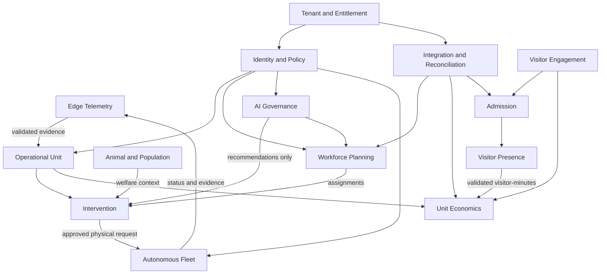

# Bounded Context Map

| Field | Value |
|---|---|
| Document ID | ES-004 |
| Status | Draft |
| Date | 2026-09-15 |
| Source | [Solution Overview](../../solution-overview-15thSept.md) |

## Relationships

| Upstream | Downstream | Relationship | Contract status |
|---|---|---|---|
| Edge Telemetry | Operational Unit | Published language: validated evidence | Planned; schema TBD under OI-005 |
| Operational Unit | Intervention | Customer-supplier: scoped unit state | Planned |
| Animal and Population | Intervention | Conformist only for imported clinical facts; local observations remain local authority | Planned |
| Workforce Planning | Intervention | Customer-supplier: qualified assignment | Planned |
| Visitor Presence | Unit Economics | Published language: validated visitor-minute | Planned |
| AI Governance | Operational contexts | Advisory recommendation; no direct consequential mutation | Planned |
| Integration and Reconciliation | External systems | Anti-corruption adapters preserve declared authority | Planned |
| Autonomous Fleet | Independent safety systems | Read-only status with separate safety authority | Planned |

No context is implemented. Boundary ownership must be confirmed before detailed design; owner is TBD (Product owner), trigger date 2026-09-30.
