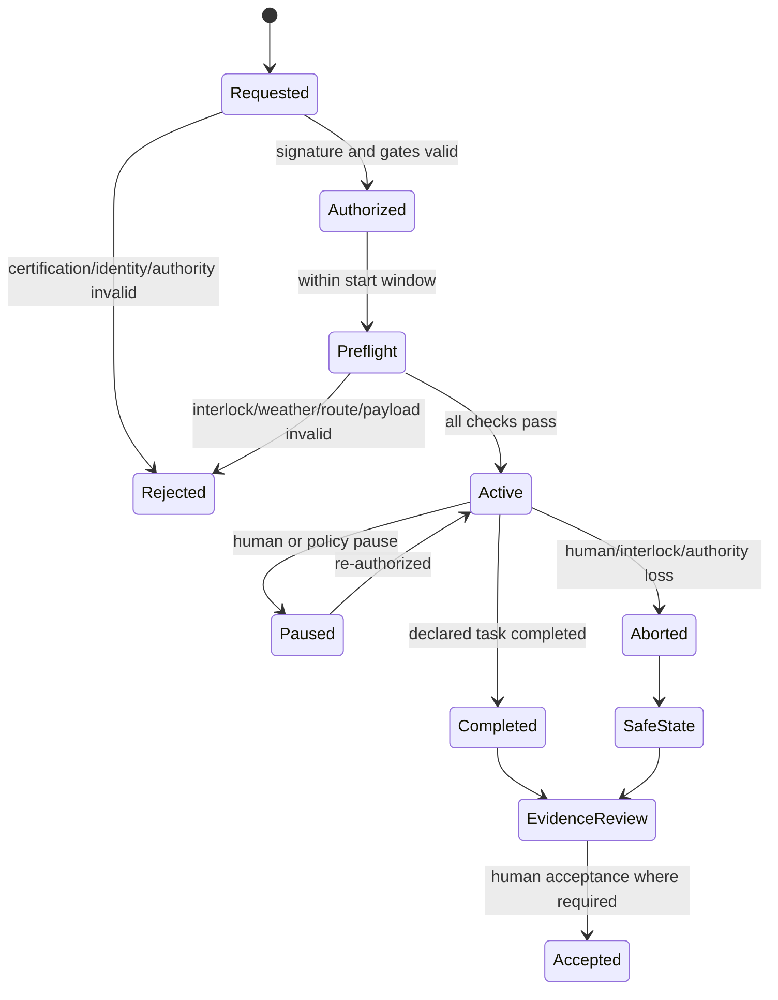

# Autonomous Missions and Safety Specification

| Field | Value |
|---|---|
| Document ID | SPEC-010 |
| Status | Draft |
| Date | 2026-09-15 |
| Source | [Solution Overview](../../solution-overview-15thSept.md) |
| Requirements | BR-007, FR-023 to FR-029, NFR-011, SEC-008, COM-006, CON-007, CON-008 |

Product 2 is `Planned`. Nothing in this artifact claims implementation, safety certification, aviation permission, or regulatory approval.

## Mission Classes

| Class | Allowed examples | Prohibited authority |
|---|---|---|
| Ground patrol | Closed-zone observation and anomaly evidence | Confrontation, facial recognition, safety or welfare declaration |
| Ground cleaning | Approved unoccupied route cleaning/disinfection | Operation near uncontrolled people or animals after a stop condition |
| Ground inspection/minor maintenance | Gauge reading, imaging, approved non-safety consumable work | Diagnosis, certified safety work, return-to-service approval |
| Ground transport | Sealed food, parts, tools, samples, or supplies | Uncontrolled contact or invalid custody |
| Aerial inspection | Approved geofenced inspection | Uncertified crowd overflight or privacy intrusion |
| IoT service | Approved non-safety sensor replacement | Safety-device work or identity mismatch continuation |
| Controlled delivery | Approved sealed supply or pre-measured food payload | Medicine, live prey, or ad hoc feeding decision |

## Signed Mission

A mission binds tenant, estate, asset, Unit ID, certified action class, route or geofence, payload, approver or approved policy, start window, expiry, abort behavior, contract version, and signature. An asset cannot interpret open-ended natural language or generate control code.

## State Model

## Independent Safety Controls

Ground assets use independent proximity and emergency-stop controls. Drones use certified geofence, altitude, collision, lost-link, return or landing, and flight-termination controls appropriate to the mission. These controls cannot depend on cloud or AI availability.

Product 2 has no write or control access to certified ride, containment, fire, or life-support systems. Read-only status cannot be interpreted as permission to bypass an independent interlock.

## Connectivity and Fleet Trust

Product 2 requires at least three geographically diverse receiver hubs or an equivalently independent communication route with overlapping coverage. Hardware-rooted identity, attested provisioning, mutual authentication, encryption, replay protection, rate limiting, signed updates, SBOM checks, staged rollout, rollback, and quarantine apply.

## Human-Only Decisions

Mechanical diagnosis, emergency medical response, incident command, legal/regulatory decisions, clinical or ethical welfare judgment, treatment, hospitalization, transfer, euthanasia, certified safety work, and approval of new action classes, routes, payloads, or safety envelopes remain human-only.

## Verification

VER-010 covers certification gates, mission tamper resistance, independent interlocks, lost authority, abort, quarantine, hub loss, custody, and prohibited action. Evidence remains TBD under OI-015 and OI-012.