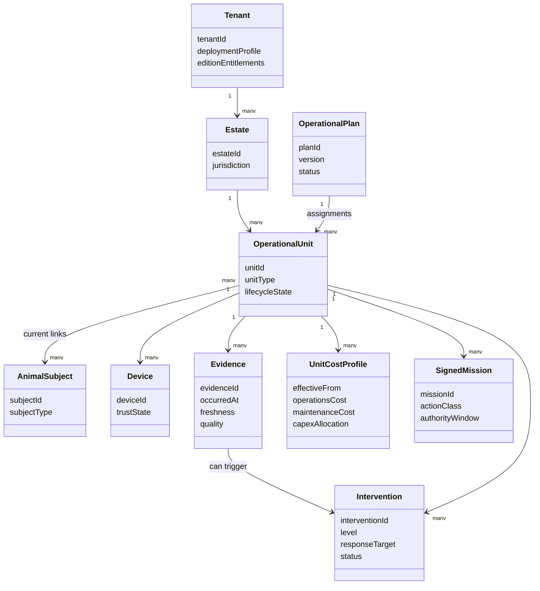

# Domain Model

| Field | Value |
|---|---|
| Document ID | SPEC-002 |
| Status | Draft |
| Date | 2026-09-15 |
| Source | [Solution Overview](../../solution-overview-15thSept.md) |

## Core Model

## Entity Invariants

| Entity | Identity and invariant | Authority | Requirements |
|---|---|---|---|
| Tenant | Tenant ID crosses API, event, storage, cache, log, metric, secret, backup, fleet, and support boundaries. | Platform management plane | FR-006, NFR-005 |
| Operational Unit | Unit ID is immutable and survives physical and naming changes. | Platform | FR-001, FR-002 |
| Animal or Population | Subject identity and history are independent of enclosure and device. | Platform for local observations; clinical systems for imported diagnoses/results | FR-003, COM-005 |
| Device | Only a provisioned, signed identity is trusted. | Fleet/device management | SEC-007, SEC-009 |
| Evidence | Occurrence time, source identity, quality, and Unit ID are retained; corrections do not erase history. | Producing context | FR-002, FR-021 |
| Intervention | Owner, response target, level, state, and verification are required. | Operations or animal-care domain | FR-009 to FR-011 |
| Operational Plan | Each change creates a version and explained diff. | Platform current plan; HRMS/EAM retain source records | FR-012 to FR-014 |
| Unit Cost Profile | Values are effective-dated and sourced from authoritative systems. | ERP/EAM/finance policy | FR-017 to FR-019 |
| Signed Mission | Scope, authority, route, payload, expiry, and abort behavior are immutable after authorization. | Fleet control with human and policy authority | FR-023 to FR-029 |

## Aggregate Boundaries

Aggregates and candidate context ownership are detailed in [Policies, Aggregates, and Read Models](../03-event-storming/policies-aggregates-read-models.md). Cross-context updates use versioned events or APIs and do not create a shared mutable domain model.

## Unresolved Model Questions

- Population aggregation is [OI-011](../00-governance/assumptions-and-open-items.md).
- Field-level external authority is [OI-005](../00-governance/assumptions-and-open-items.md).
- Pass Token legal and accounting treatment is part of [OI-008](../00-governance/assumptions-and-open-items.md).
