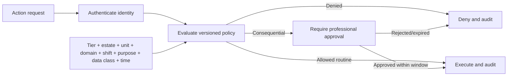

# Identity, Access, and Policy Specification

| Field | Value |
|---|---|
| Document ID | SPEC-008 |
| Status | Draft |
| Date | 2026-09-15 |
| Source | [Solution Overview](../../solution-overview-15thSept.md) |
| Requirements | FR-022, SEC-001 to SEC-007, NFR-005 |

## Identity Model

Workforce authentication federates through OIDC/OAuth 2.0 to the operator identity provider. Devices, gateways, workloads, integrations, robots, drones, and mission-signing authorities use managed certificates or equivalent short-lived workload identities.

Animals and managed populations are domain subjects and never receive credentials or permissions.

## Authorization Decision

## Policy Record

| Field | Purpose |
|---|---|
| Policy ID and version | Stable decision provenance |
| Subject type and identity | Person, service, device, partner, robot, or drone |
| Tier and professional domain | Baseline scope, not a blanket grant |
| Tenant, estate, unit, and shift | Operational boundary |
| Purpose and data class | Purpose limitation and sensitivity |
| Action and consequence class | Permitted operation and approval rule |
| Effective window | Start, expiry, emergency duration |
| Decision and reason | Allow, deny, elevation required, policy evidence |

## Privileged Access

Standing access to PII, welfare, payroll, fleet command, or financial data is denied. Support, OEM, delegated operations, and emergency access requires request, reason, scope, approver, start, expiry, session identity, action log, and review.

Quarterly access review is coordinated by the Safety and Compliance lead with each domain owner. Orphaned, stale, excessive, and unused access is revoked or escalated.

## Secrets and Certificates

Reusable credentials cannot be embedded in software or firmware. A centralized secrets capability issues short-lived credentials and supports automated rotation and revocation. Certificate lifecycle covers provisioning, attestation, issuance, renewal, expiry monitoring, compromise response, and decommissioning.

## Verification

VER-008 covers contextual decisions, domain separation, tenant isolation, elevation, review, secrets, and certificate lifecycle. Evidence remains TBD under OI-015.
