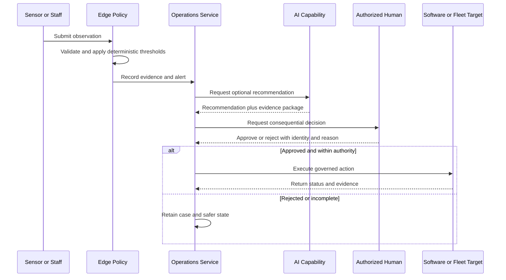

# System Specification

| Field | Value |
|---|---|
| Document ID | SPEC-001 |
| Status | Draft |
| Date | 2026-09-15 |
| Source | [Solution Overview](../../solution-overview-15thSept.md) |
| Requirements | [Requirements Index](../02-requirements/requirements-index.md) |

## Scope

The Autonomous Estate Management Platform comprises Product 1, the Operations Intelligence Platform, and planned Product 2, the Autonomous Actuation Layer. Product 1 senses conditions, validates evidence, coordinates work, recommends actions, and records outcomes. Product 2 executes certified physical missions only after required approvals and certification gates.

## System Behaviors

| Behavior | Inputs | Processing | Outputs | Failure behavior | Requirements |
|---|---|---|---|---|---|
| Observe and alert | Signed telemetry, edge vision, human observation | Validate identity, time, unit, freshness, quality, and deterministic thresholds | Evidence, alert, intervention | Quarantine untrusted evidence; never suppress a valid critical alert | FR-002, FR-007 to FR-010, NFR-002 |
| Intervene and recover | Alert, procedure, assignee, authority | Route Level 1, escalate, invoke specialist, verify recovery | Intervention history and unit status | Default to safer state when evidence or authority is missing | FR-009 to FR-011, FR-022 |
| Plan and re-plan | Demand, staff, qualification, unit, task, weather, asset state | Evaluate constraints and issue a versioned plan diff | Authorized plan and assignments | Escalate unsatisfied mandatory coverage | BR-005, FR-012 to FR-014 |
| Admit and measure | Entitlement, anti-replay state, entry/exit evidence | Validate locally, aggregate occupancy, calculate duration | Admission evidence, queue estimate, visitor-minutes | Deny or hold ambiguous entitlement; reconcile later | FR-015, FR-016, NFR-001 |
| Attribute unit value | Visitor-minutes, weights, price, package, costs | Effective-date, calculate, allocate once, reconcile | Unit Credits, attributed revenue, contribution | Quarantine conflicts and block unbalanced posting | FR-017 to FR-019, NFR-009, NFR-010 |
| Govern AI | Approved data, capability configuration, evaluation gates | Generate finding, attach evidence, apply deterministic policy | Recommendation or disabled capability | Route uncertainty or failed evidence to human review | FR-020 to FR-022, CON-004 |
| Execute mission | Signed mission, certified asset, route, payload, interlocks | Validate authority and envelope, execute declared steps | Status, evidence, outcome, exception | Local safe stop, return, hover, landing, abort, or quarantine | FR-023 to FR-029, CON-007, CON-008 |

## Consequential Action Sequence

## State and Authority Rules

1. Deterministic safety and welfare gates take precedence over AI output.
2. Independent safety systems remain read-only to the platform.
3. External systems remain authoritative for records identified in the integration specification.
4. Historical evidence is append-only from the business perspective; corrections create linked records.
5. Product 2 is `Planned` and disabled until BR-007 and FR-028 evidence exists.

## Acceptance Boundary

Acceptance is governed by the [Verification Plan](../06-delivery/verification-plan.md), [Quality Gates](../06-delivery/quality-gates-and-evidence.md), and [Traceability Matrix](../06-delivery/traceability-matrix.md). No acceptance evidence currently exists under OI-015.
