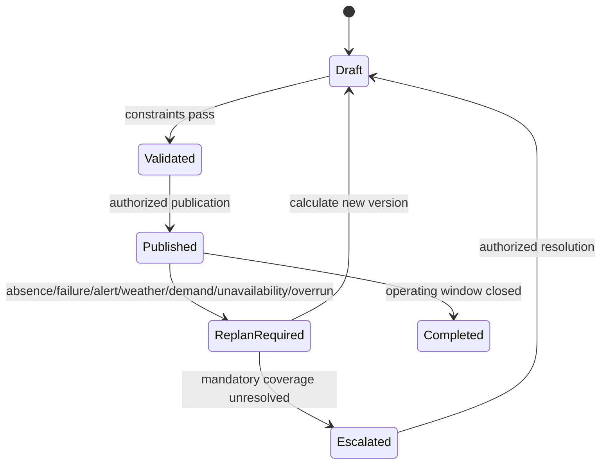

# Workforce and Offline Operations Specification

| Field | Value |
|---|---|
| Document ID | SPEC-004 |
| Status | Draft |
| Date | 2026-09-15 |
| Source | [Solution Overview](../../solution-overview-15thSept.md) |
| Requirements | BR-003, BR-005, FR-012 to FR-014, NFR-001 |

## Authority

HRMS and payroll own people, employment, qualifications, and payroll records. EAM owns approved asset work. The platform owns the current Operational Plan, local assignments, procedure execution, and execution evidence.

## Plan Model

| Element | Required content |
|---|---|
| Plan | Plan ID, estate, operating window, version, status, author, policy version |
| Assignment | Unit, task, shift, person or asset, role, required qualification, start/end |
| Constraint result | Rule ID, pass/fail, evidence freshness, explanation |
| Re-plan diff | Trigger, prior version, new version, additions, removals, substitutions, unresolved conflicts |

## Constraint Order

Safety and mandatory welfare constraints take precedence. The complete ordering among welfare, staffing, working-time, demand, equipment, and cost is TBD (Workforce planner, trigger 2026-09-30) under OI-004 and cannot be inferred from the source.

## Re-Planning

Every re-plan records its trigger, policy version, explained diff, unresolved constraints, and approver where required. A missing qualified substitute is escalated and cannot be hidden by an AI recommendation.

## Offline Operation

| Phase | Behavior |
|---|---|
| Connected | Synchronize authoritative reference data and current plan; retain local working set. |
| Isolated | Continue approved alerting, animal care, admission, device, workforce, and dashboard functions for 72 hours. |
| Storage pressure | Preserve critical evidence first; exact thresholds and shedding policy are OI-007. |
| Reconnection | Authenticate, submit idempotent records, order by business occurrence time, detect conflicts, and reconcile without overwriting newer confirmed state. |
| Conflict | Place the item in an owned resolution queue and preserve both versions and provenance. |

## Verification

VER-003 and VER-006 cover 72-hour isolation, plan constraints, substitution, handover, storage pressure, late events, conflict handling, and replay. Evidence remains TBD under OI-015.
