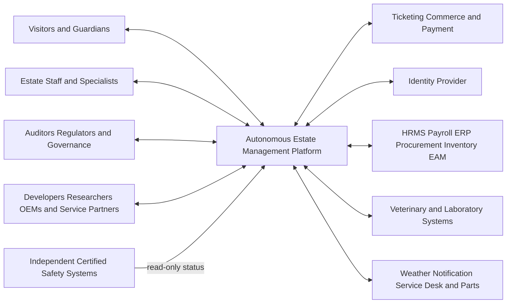

# C1 System Context

| Field | Value |
|---|---|
| Document ID | ARCH-002 |
| Status | Draft |
| Date | 2026-09-15 |
| Implementation | Planned |
| Source | [Solution Overview](../../../solution-overview-15thSept.md) |

## Relationships

| External party/system | Purpose | Direction | Protocol | Authority and failure rule |
|---|---|---|---|---|
| Visitors and guardians | Admission, queues, consent, engagement | Bidirectional | Planned applications/APIs | Own requests; platform applies consent and guardian policy. |
| Estate staff and specialists | Plans, tasks, approvals, evidence | Bidirectional | Planned offline-capable applications/APIs | Professional authority remains domain scoped. |
| Governance and ecosystem users | Governed review, export, support | Bidirectional | Purpose-limited API/export/session | No unrestricted raw operational access. |
| External systems | Identity, commerce, enterprise, clinical, weather, notification, service | Bidirectional except safety | See [Integration Specification](../../04-specifications/integrations-and-contracts.md) | Failures queue, degrade, deny, or use local fallback by contract. |
| Independent safety systems | Certified status only | Into platform | Isolated read-only interface | Never controlled by the platform. |

Owners, contracts, timeouts, and retries are maintained in the [Integration Specification](../../04-specifications/integrations-and-contracts.md).
