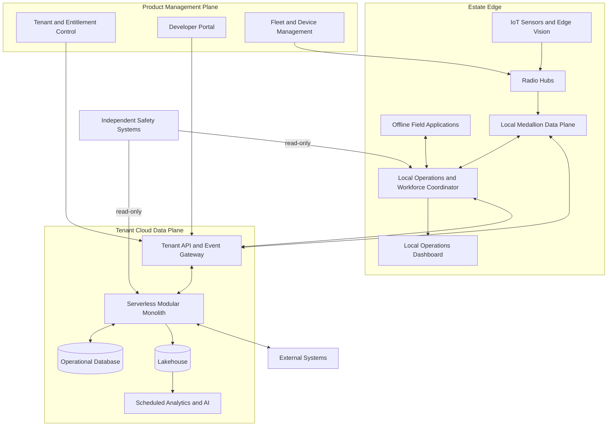

# C2 Containers

| Field | Value |
|---|---|
| Document ID | ARCH-003 |
| Status | Draft |
| Date | 2026-09-15 |
| Implementation | Planned |
| Source | [Solution Overview](../../../solution-overview-15thSept.md) |

## Container Responsibilities

| Container | Responsibility | Data | Failure behavior |
|---|---|---|---|
| Devices and radio hubs | Collect signed observations and transport local evidence. | Telemetry and derived vision events | Buffer, quarantine, or degrade coverage; Product 2 requires route diversity. |
| Offline field applications | Execute assigned work and capture evidence. | Scoped tasks, procedures, local outcomes | Continue within authorized local window. |
| Local data plane | Store and promote Bronze/Silver/Gold evidence. | Local operational evidence | Prioritize critical data and replay idempotently. |
| Local coordinator/dashboard | Apply deterministic policy, alerts, plans, and local visibility. | Current unit, alert, plan, and task state | Operate for 72 hours; use safer state. |
| API/event gateway | Authenticate, tenant-scope, version, and route cloud traffic. | API and event envelopes | Reject invalid scope; queue eligible asynchronous traffic. |
| Modular monolith | Coordinate planned domain modules and integrations. | Operational state and workflows | Isolate failed adapters and preserve local operation. |
| Operational database | Persist current cloud operational state. | Tenant-scoped transactional data | Restore and reconcile; RTO/RPO are OI-007. |
| Lakehouse/analytics/AI | Hold approved data and run scheduled analysis. | Approved Silver/Gold data and assurance evidence | Disable AI or defer analytics without suppressing critical local behavior. |
| Management plane | Control tenant, entitlement, developer, fleet, and lifecycle policy. | Configuration and fleet metadata | No standing access to sensitive tenant records. |
