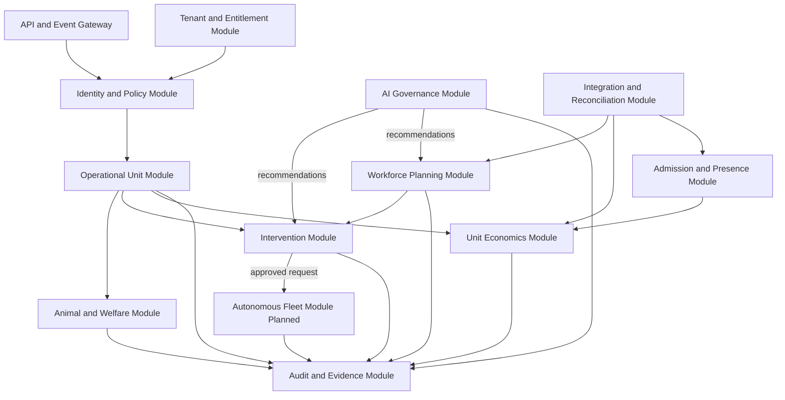

# C3 Components

| Field | Value |
|---|---|
| Document ID | ARCH-004 |
| Status | Draft |
| Date | 2026-09-15 |
| Implementation | Planned |
| Source | [Solution Overview](../../../solution-overview-15thSept.md) |

This view decomposes planned responsibilities inside the local coordinator and serverless modular monolith. It is not a code map.

## Planned Components

| Component | Responsibility | Requirements | Failure containment |
|---|---|---|---|
| Identity and Policy | Contextual authorization and elevation | FR-022, SEC-001 to SEC-007 | Deny incomplete or expired authority. |
| Operational Unit | Stable unit identity and linked evidence | FR-001, FR-002 | Preserve identity and history. |
| Animal and Welfare | Subject identity, observation, and welfare context | BR-002, FR-003, CON-004 | Escalate; retain clinical authority outside AI. |
| Intervention | Alerts, intervention lifecycle, safer state | FR-009 to FR-011 | Deterministic critical handling remains local. |
| Workforce Planning | Constraint-aware plans and versioned re-planning | FR-012 to FR-014 | Escalate unsatisfied mandatory coverage. |
| Admission and Presence | Entitlement evidence, occupancy, queues | FR-015, FR-016 | Use local anti-replay and withhold unsafe aggregates. |
| Unit Economics | Credits, attribution, cost, reconciliation | FR-017 to FR-019, NFR-009, NFR-010 | Block duplicates and unbalanced posting. |
| AI Governance | Capability lifecycle, evaluation, recommendation evidence | FR-020, FR-021, FR-033 | Disable and fall back to deterministic or staff process. |
| Integration and Reconciliation | External adapters, authority, inbox/outbox, resolution | FR-004, FR-005 | Isolate adapter, queue, reconcile. |
| Tenant and Entitlement | Tenant scope, edition, deployment policy | FR-006, NFR-005, NFR-006 | Reject missing tenant scope. |
| Autonomous Fleet | Signed missions and fleet lifecycle | FR-023 to FR-029 | Independent interlock and safe state. |
| Audit and Evidence | Append-only business evidence and provenance | Cross-cutting | Preserve original and correction records. |

Detailed interfaces remain TBD under OI-005 and are governed by the [Domain Model](../../04-specifications/domain-model.md).
