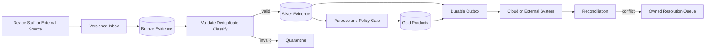

# Data and Integration View

| Field | Value |
|---|---|
| Document ID | ARCH-007 |
| Status | Draft |
| Date | 2026-09-15 |
| Implementation | Planned |
| Source | [Solution Overview](../../../solution-overview-15thSept.md) |

## Data Contracts

All messages carry version, identity, tenant/estate scope, occurrence and publication time, idempotency, correlation, classification, and integrity metadata. Detailed external owners, directions, protocols, contracts, timeouts, retries, and failure handling are maintained in the [Integration Specification](../../04-specifications/integrations-and-contracts.md).

## Authority Rules

- Devices and staff own attributable source observations; platform policy owns validation state.
- Clinical systems own imported diagnoses and laboratory results; the platform owns local welfare observations.
- Ticketing/payment, HRMS/payroll, and ERP/EAM retain their declared authority.
- The platform owns local admission evidence, current Operational Plans, interventions, Unit Credits, and governed attribution calculations.
- Conflicts create resolution work and never silently overwrite confirmed state.

## Privacy and Retention

Raw edge media remains local by default. Visitor presence is minimized and aggregated. Retention, residency, and cross-border policy are specified in [Data and Retention](../../04-specifications/data-and-retention.md) and open items OI-010/OI-013.

Requirements: FR-004, FR-005, FR-007, FR-008, FR-015, NFR-004, COM-003, CON-001.
