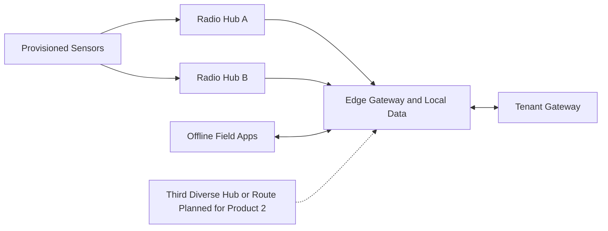

# Edge and Connectivity View

| Field | Value |
|---|---|
| Document ID | ARCH-006 |
| Status | Draft |
| Date | 2026-09-15 |
| Implementation | Planned |
| Source | [Solution Overview](../../../solution-overview-15thSept.md) |

## Topology

Product 1 uses private LoRaWAN with two overlapping receiver hubs. Product 2 requires a third geographically diverse hub or equivalently independent route before activation.

## Processing Allocation

| Work | Location | Timing | Failure behavior |
|---|---|---|---|
| Critical evidence validation and alerting | Edge | Alert within 10 seconds | Continue locally and prioritize durable evidence. |
| Admission decisions | Edge where authorized | Interactive | Use local anti-replay and reconcile after recovery. |
| Workforce execution and dashboard | Edge | Interactive | Continue for 72 hours. |
| Routine telemetry promotion/sync | Edge to cloud | Within four hours when route available | Queue and replay idempotently. |
| Analytics and non-critical AI | Cloud or approved edge capability | Scheduled | Defer or disable without affecting critical policy. |

## Capacity

Baseline derived vision throughput is 50 to 100 events/second; 3x is 150 to 300 events/second. Sensor count, LoRaWAN duty-cycle validation, local disk sizing, power, backhaul, congestion, and RTO/RPO remain OI-007.

## Failure Modes

| Failure | Response |
|---|---|
| WAN loss | Enter authorized isolation mode; preserve critical operation for 72 hours. |
| Hub loss | Product 1 uses overlap; Product 2 must retain command, alert, and visibility through an independent route. |
| Untrusted/spoofed telemetry | Quarantine or flag; never silently trust. |
| Gateway compromise | Isolate segment and revoke command authority. |
| Storage pressure | Preserve critical evidence first; exact shedding thresholds are TBD. |
| Late/duplicate data | Retain provenance; do not overwrite newer confirmed state. |

Requirements: BR-003, FR-007, FR-008, NFR-001 to NFR-004, NFR-007, NFR-008, NFR-011, SEC-009.
