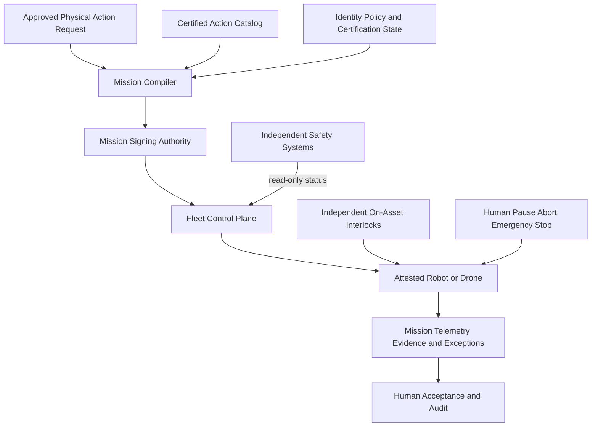

# Robotics and Drone Safety View

| Field | Value |
|---|---|
| Document ID | ARCH-011 |
| Status | Draft |
| Date | 2026-09-15 |
| Implementation | Planned |
| Source | [Solution Overview](../../../solution-overview-15thSept.md) |

## Safety Independence

Mission compilation and fleet control cannot disable or replace on-asset proximity, emergency stop, geofence, altitude, collision, lost-link, return/landing, or flight-termination controls. Emergency control cannot depend on cloud or AI availability.

## Authorization Chain

1. Product 1 maturity and certification gate passes.
2. Asset identity and maintenance/certification state are valid.
3. Action, route, Unit ID, payload, and operator model are certified.
4. Human or approved low-risk policy authorizes the mission.
5. Mission is signed with start, expiry, and abort behavior.
6. Asset validates mission and preflight interlocks locally.
7. Exceptions enter a local safe state and alert an operator.

## Connectivity

At least three geographically diverse receiver hubs or an equivalently independent route provide overlapping Product 2 coverage. Loss of one hub may reduce capacity but cannot eliminate command, alert, or visibility coverage. Evidence is required before activation and remains OI-012.

## Prohibited Paths

- No model-generated control code or open-ended natural-language task.
- No write or command path to certified ride, containment, fire, or life-support systems.
- No diagnosis, treatment, confrontation, facial recognition, medicine delivery, live-prey delivery, or ad hoc feeding decision.
- No mission continuation after loss of authority outside certified lost-link behavior.

Requirements: BR-007, FR-023 to FR-029, NFR-011, SEC-008, COM-006, CON-004, CON-007, CON-008.