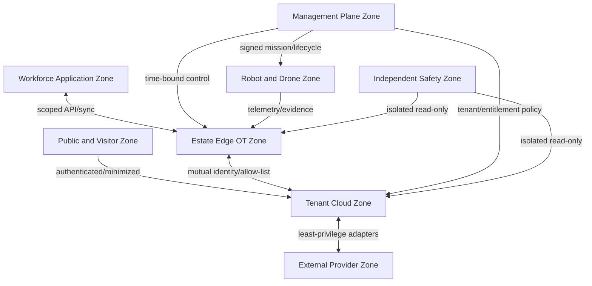

# Security and Trust View

| Field | Value |
|---|---|
| Document ID | ARCH-008 |
| Status | Draft |
| Date | 2026-09-15 |
| Implementation | Planned |
| Source | [Solution Overview](../../../solution-overview-15thSept.md) |

## Trust Zones

## Controls

| Boundary | Control | Failure behavior |
|---|---|---|
| Person to platform | Federated authentication and contextual authorization | Deny missing or expired scope. |
| Privileged/support access | Approved, time-bound elevation with session audit | Terminate at expiry; revoke on anomaly. |
| Device/fleet to edge | Hardware/workload identity, mutual authentication, signed telemetry | Quarantine untrusted identity. |
| Edge to cloud | Encryption, tenant scope, allow-listed protocols, replay protection | Queue eligible evidence; reject invalid scope. |
| Tenant to external | Least-privilege adapter identity and versioned contract | Isolate adapter and reconcile. |
| Platform to safety systems | Read-only isolated contract | No write path exists. |
| Release/update | Provenance, scanning, SBOM, signature, staged rollout, rollback | Stop rollout and restore approved version. |

Tenant identity is propagated across every technical boundary. Zero unauthorized cross-tenant access is a release gate. Secrets are short-lived and centrally managed; no reusable secret is embedded.

Requirements: NFR-005, SEC-001 to SEC-012, CON-003, CON-005, CON-007.
