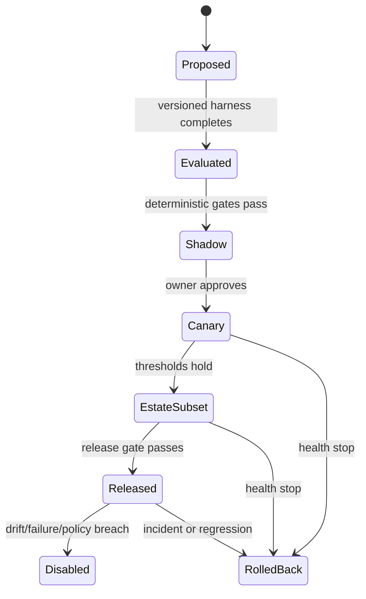

# AI Governance Specification

| Field | Value |
|---|---|
| Document ID | SPEC-009 |
| Status | Draft |
| Date | 2026-09-15 |
| Source | [Solution Overview](../solution-overview-15thSept.md) |
| Requirements | FR-020 to FR-022, FR-033, CON-004 |

## Capability Record

Every AI capability records a named owner, purpose, risk class, approved data, evaluation set, task metric and threshold, cost and latency budget, fallback, rollback, and enabled estate scope. AI remains advisory until these delivery controls are configured.

## Lifecycle

These lifecycle labels describe capability state, not document status.

## Recommendation Evidence

Each recommendation includes source signals and freshness, applicable deterministic rule, model, provider, prompt and policy versions, confidence and uncertainty, material factors, alternatives, rationale, capability owner, and correlation to later approval and outcome.

## Evaluation Harness

| Dimension | Required evaluation |
|---|---|
| Task quality | Domain metric against a versioned representative set |
| Safety and policy | Deterministic assertions that must all pass |
| Privacy and fairness | Protected and vulnerable population scenarios, consent, minimization, equivalent access |
| Adversarial | Prompt injection, hostile input, data exfiltration, tool misuse, and unsupported action |
| Reliability | Missing, stale, contradictory, delayed, and unavailable inputs |
| Operations | Latency, cost, fallback, rollback, and provider outage |
| Regression | Comparison with approved prior version |

An evaluator model can score groundedness, relevance, policy adherence, and explanation quality only when deterministic metrics are insufficient. It requires a versioned rubric, evidence, model version, score, disagreement record, and calibration against qualified human reviewers. It cannot be the sole release gate or approve consequential action.

## Runtime Rules

1. AI never suppresses a deterministic critical alert.
2. AI never becomes authoritative for tickets, safety, treatment, population correction, settlement, or public communication.
3. Missing evidence, failed evaluation, excessive disagreement, or suspected shared-model bias routes to qualified human review and cannot default to approval.
4. Automation is restricted to the approved low-risk reversible action catalog.
5. Corrections retain reasons and feed evaluation without rewriting history.

## Verification

Verification covers deterministic gates, recommendation completeness, adversarial cases, judge calibration, human approval, drift disablement, fallback, and rollback. Evidence is produced during delivery.
