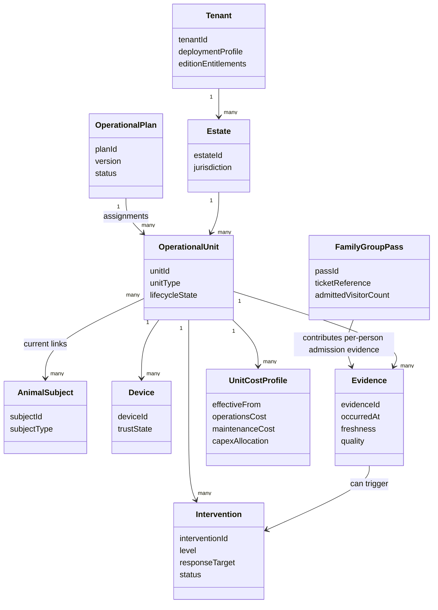

# Domain Model

| Field | Value |
|---|---|
| Document ID | SPEC-002 |
| Status | Draft |
| Date | 2026-09-16 |
| Source | [Solution Overview](../solution-overview-15thSept.md) |

## Core Model

## Entity Invariants

| Entity | Identity and invariant | Authority | Requirements |
|---|---|---|---|
| Tenant | Tenant ID crosses API, event, storage, cache, log, metric, secret, backup, device-command, and support boundaries. | Platform management plane | FR-006, NFR-005 |
| Operational Unit | Unit ID is immutable and survives physical and naming changes. | Platform | FR-001, FR-002 |
| Animal or Population | Subject identity and history are independent of enclosure and device. | Platform for local observations; clinical systems for imported diagnoses/results | FR-003, FR-049, COM-005 |
| Device | Only a provisioned, signed identity is trusted. | Device management | SEC-007, SEC-009 |
| Evidence | Occurrence time, source identity, quality, and Unit ID are retained; corrections do not erase history. | Producing context | FR-002, FR-021, FR-048 |
| Intervention | Owner, response target, level, state, and verification are required. | Operations or animal-care domain | FR-009 to FR-011 |
| Operational Plan | Each change creates a version and explained diff. | Platform current plan; HRMS/EAM retain source records | FR-012 to FR-014 |
| Unit Cost Profile | Values are effective-dated and sourced from authoritative systems. | ERP/EAM/finance policy | FR-017 to FR-019 |
| Family or Group Pass | Represents one ticketing purchase that admits multiple people; each admitted person is counted individually as a visitor, the same as an individual-ticket holder. | Ticketing provider for sale, pricing, and issuance; platform for per-person admission attribution | FR-050 |

## Aggregate Boundaries

The ownership column above defines aggregate and candidate context ownership. Cross-context updates use versioned events or APIs and do not create a shared mutable domain model.

## Unresolved Model Questions

- Population views expose welfare exceptions and trends; FR-049 adds a governed population-count discrepancy check, while species-specific clinical rules remain with veterinary operations.
- External systems remain authoritative for their source records; adapters reconcile conflicts.
- Pass Tokens are future prepaid-access entitlements separate from Unit Credits and Visitor Coins.
- Maximum group size, member age rules, and pricing linkage for the Family or Group Pass are TBD (Product owner, trigger 2026-10-15).
