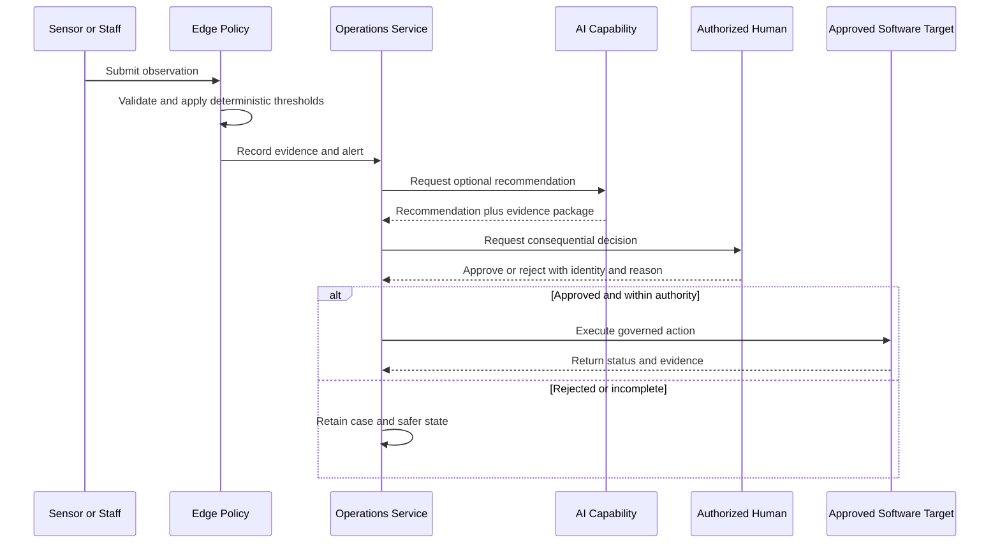

# System Specification

| Field | Value |
|---|---|
| Document ID | SPEC-001 |
| Status | Draft |
| Date | 2026-09-16 |
| Source | [Solution Overview](../solution-overview-15thSept.md) |
| Requirements | [Requirements Index](../requirements/requirements-index.md) |

## Scope

The current system baseline covers the Operations Intelligence Platform. It senses conditions, validates evidence, coordinates work, recommends actions, executes approved low-risk reversible software actions, and records outcomes.

## System Behaviors

| Behavior | Inputs | Processing | Outputs | Failure behavior | Requirements |
|---|---|---|---|---|---|
| Observe and alert | Signed telemetry, edge vision, human observation, feeding/nutrition observation | Validate identity, time, unit, freshness, quality, and deterministic thresholds | Evidence, alert, intervention | Quarantine untrusted evidence; never suppress a valid critical alert | FR-002, FR-007 to FR-010, FR-048, NFR-002 |
| Intervene and recover | Alert, procedure, assignee, authority | Route Level 1, escalate, invoke specialist, verify recovery | Intervention history and unit status | Default to safer state when evidence or authority is missing | FR-009 to FR-011, FR-022 |
| Plan and re-plan | Demand, staff, qualification, unit, task, weather, asset state | Evaluate constraints and issue a versioned plan diff | Authorized plan and assignments | Escalate unsatisfied mandatory coverage | BR-005, FR-012 to FR-014 |
| Admit and measure | Entitlement, anti-replay state, entry/exit evidence, Family or Group Pass linkage | Validate locally, count each admitted individual as one visitor, aggregate occupancy, calculate duration | Admission evidence, queue estimate, visitor-minutes | Deny or hold ambiguous entitlement; reconcile later | FR-015, FR-016, FR-050, NFR-001 |
| Attribute unit value | Visitor-minutes, weights, price, package, costs | Effective-date, calculate, allocate once, reconcile | Unit Credits, attributed revenue, contribution | Quarantine conflicts and block unbalanced posting | FR-017 to FR-019, NFR-009, NFR-010 |
| Report operational evidence | Unit and zone utilization, demand, downtime, data-quality evidence | Aggregate and correlate evidence per unit and zone | Staffing and investment reporting | Flag incomplete or stale evidence rather than presenting false confidence | FR-047 |
| Govern AI | Approved data, capability configuration, evaluation gates | Generate finding, attach evidence, apply deterministic policy | Recommendation or disabled capability | Route uncertainty or failed evidence to human review | FR-020 to FR-022, CON-004 |

## Consequential Action Sequence

## State and Authority Rules

1. Deterministic safety and welfare gates take precedence over AI output.
2. Independent safety systems remain read-only to the platform.
3. External systems remain authoritative for records identified in the integration specification.
4. Historical evidence is append-only from the business perspective; corrections create linked records.

## Acceptance Boundary

Acceptance uses the verification methods and observable evidence defined by the applicable requirements. Acceptance evidence is produced during delivery.
